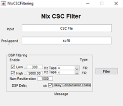

# Spike sorting

We'll cover how to spike sort using two programs: 1) Spike2 (written by Tony
Lapsanksy), and 2) Neuralynx (written by Eric Press)

## Spike2

Written by Tony Lapsansky, February 24, 2023

1.  Save the Spike2 file
    1.  Use the name structure `YEARMODA_sequence_investigator`
    2.  Save data in the corresponding directory
        `“C:\InvestigatorName\ephys\YEAR-MO-DA”`
2.  Open `Spike2` and open the file
3.  Apply a digital high pass filter if needed. Note that if the data were
    collected with the high pass filter set at greater than 100 Hz (no LFP
    signal) then skip to step 4.
    1.  Right click on channel and select `FIR Digital Filters…` (see Spike 2
        help → index `Digital Filter` for explanation)
    2.  Under the pull down menu for `Filter` change from
        `Example low pass filter` to `Example high pass filter`
    3.  Select the `Show Details` button in the bottom right
    4.  Adjust blue slider to shift the colour dots above the slider from red to
        yellow to green, but use the minimum level to achieve green. Fine
        adjustments can be made just under the slider.
    5.  Hit `Apply`
    6.  Set `Destination` to the next available channel (often channel 4)
    7.  Click Okay
    8.  Close the filtering window. You are given the option to save the filter.
        Do not do this. It is important to set the filter each time. (?)
4.  Set thresholds for spikes
    1.  Right click on the filtered channel and select `New WaveMark`
    2.  Clear previous templates if any are present. To do so, select the trash
        can icon within each template.
    3.  Locate the dashed vertical line, which can be found at time 0 in the
        main window. This line indicates your cursor position.
    4.  Move the dashed line through the trace to observe potential spike as
        determined by the default upper and lower thresholds.
    5.  Right click the upper bound marker (the upper horizontal dashed line in
        the `WaveMark` window) and select `move away`
    6.  Identify spikes based on the lower bound. It is usually helpful to zoom
        in on the x-axis (time) to do this. Set the lower bound so that obvious
        spikes are included and ambiguous spikes are excluded.
5.  Choose template setting
    1.  Move the cursor to a typical spike. The upper window is a base template.
        Click and hold on the upper trace and drag it to the first available
        template window.
    2.  Click on the button just to the left of the trash can icon (on the top
        half, upper right of the `WaveMark` window). This is the
        `parameters dialog` button. This opens a template settings window.
    3.  For the line `Maximum amplitude change for a match` enter `20`. This
        will allow a spike that fits a template to vary in maximum amplitude by
        up to 20%.
    4.  For the line `Remove the DC offset before template matching`, confirm
        that the box is checked.
    5.  Nothing else should need to be changed. Click `OK`.
6.  Spike sorting
    1.  Back in the `WaveMark` window, make sure that the box `Circular replay`
        is unchecked, and that the box `Make Templates` is checked.
    2.  Ensure that the vertical cursor on the main window is at time zero (or
        the first spike).
    3.  Hit the play button ▶️, which is called "run forward". This will take
        several minutes.
7.  Use PCA to delete and merge spike templates
    1.  Select `New Channel` on the `WaveMark` window to place the spike data in
        the next available channel (typically, Channel 5)
    2.  Close the `WaveMark` window.
    3.  Right click on the sorted channel and select `Edit WaveMark`
    4.  Within the `WaveMark` window, go the pull down menu `Analyse` and select
        `Principal components`. Select `OK`. This opens a window of all spikes
        colored by template.
    5.  Rotate around all three axes to determine if there is one, two, or more
        clusters.
    6.  Identify templates that should be deleted and those that should be
        merged. Delete templates that sparse and peripheral.
    7.  Delete the template(s) in the `WaveMark` window by selecting that
        template's trash can icon.
    8.  Merge templates by dragging them into the same window
    9.  Hit the "reclassify" button in the `WaveMark` window.
8.  Export the spike-sorted data
    1.  `File → Export As`
    2.  Select `.mat` (Matlab data)
    3.  Use the same filename and location but with the .mat extension.
    4.  Hit `Save`
    5.  Select `Add` for `All Channels`
    6.  Click `Export`
    7.  Click `OK` (this will take several minutes)

## Neuralynx

Written by Eric Press, November 11, 2022

1.  Spike sorting database:

    1.  Check the column labelled `Sorting status` to find days of recording
        that are `cued` meaning they are ready to be sorted. Recordings are cued
        for spike sorting once information about the recording has been added to
        the database. This includes observations from the day's recording,
        whether the electrode position was moved from the previous recording,
        and the stimulus condition for each recording. The recordings are stored
        at the following location and are named/organized by date and time of
        recording:\
        `Computer/LaCie (D:)/Eric’s data/nlx_recordings`

2.  Filtering the raw traces (CSCs):

    1.  Use the `NlxCSCFiltering` tool on any Windows machine to run a band-pass
        filter on input `CSC` files.

    2.  Choose all the `CSC` files for a given recording, change the `PreAppend`
        field to `spfilt`, which stands for spike-filtered and adjust the `DSP`
        filtering fields to match the image to the right. This selects for
        frequencies in the raw traces where spikes will be found, but removes
        low frequency (LFP) and high frequency components of the traces.

3.  Examine the filtered traces:

    1.  Take a closer look at the filtered traces (Open in `Neuraview` on any
        Windows machine) and determine which channels are likely to have
        isolatable spikes and how many distinct spikes there might be. It helps
        to keep `Neuraview` open when setting thresholds in the next step.

4.  Spike detection from filtered traces:

    1.  Use the `CSCSpikeExtractor` tool on any Windows machine to detect spikes
        above or below a given µV) threshold. The units displayed in the program
        will be AdBitVolts which are simply 10.92x from the µV value.

    2.  Based on the filtered traces, within `CSCSpikeExtractor`, set the spike
        extraction properties (`Spike Extraction -> Properties` OR `Ctrl+P`) as
        shown above. The `Extraction Value` is set to 10.92x the µV you chose by
        viewing the filtered traces.

    3.  Press `Ctrl+S` to extract spikes from the selected file at the desired
        settings. The resulting file will be placed in the `extracted spikes`
        filter on the `Desktop`.

    4.  Create subfolders in the recording folder for each threshold and move
        the extracted spikes at each threshold into the appropriate folder.
        These spike-detected files will be used for spike sorting in the next
        step.

    5.  **If it helps with detecting real spike waveforms while eliminating
        noise, run recordings through spike detection at multiple threshold
        (positive or negative) such that only all putative neurons are accounted
        for a minimal noise is detected.**

5.  Spike sorting:

    1.  Open the extracted spikes in `Spikesort3D` on either the Neuralynx
        machine or another Windows machine that has an active `SpikeSort3D`
        licence. You can also use `TeamViewer` to control the Neuralynx machine
        but this works much better with another Windows machine.

    2.  Press OK when the feature selection window appears. If you want to
        select alternate features to display, select them from the list
        provided. Sometimes it can be helpful to use PCA1 -- 3 in isolating
        neurons but often it makes things more challenging.

    3.  Using the 3D Plot, examine the clustering of spikes. Follow the image
        below to aid in interacting with the 3D plot (MB = the scroll wheel
        button i.e. middle mouse button). You can change the features displayed
        on each axis with `Q/W`, `A/S`, and `Z/X` respectively. Also, `Ctrl+P`
        brings up a window that allows you to change the size and opacity of
        points on the plot (I find `size = 2`, `alpha = 0.5` works well to
        improve visual definition of the clusters). If distinct clusters are
        difficult to see, find the combination of 3 features that produces the
        most noticeable clustering or the greatest spread of points in the
        space. The features displayed in the 3D plot are shown at the top left
        of the plot (i.e. X(3) Height \# \# \# \#). Use those features for the
        next step. 

    4.  Run `KlustaKwik` (`Cluster → Autocluster using KlustaKwik`) and select
        the 3 features that generate the most clearly separable clusters on the
        3D view -- often, the first 3 (`Peak`, `Valley`, `Energy`) do a decent
        job. Change the `MaxPossibleClusters` to `10` before pressing `Run`. The
        remaining settings should match the image below. 

    5.  Following calculations, use the `Waveform` window and the 3D plot to
        group the distinct clusters into what you believe are waveforms produced
        by distinct neurons. Use the number keys to highlight distinct clusters
        and `Ctrl+M` to merge clusters together. `Ctrl+C` copies the selected
        cluster and can be used to split a cluster into 2 if you believe
        portions of the cluster belong to distinct putative neurons. This step
        takes some practice. You can use `Ctrl+Z` to undo only one move.
        Otherwise, you may need to exit without saving and start again at
        step 4. Save with `Ctrl+S` often and click OK to overwrite the file.

    6.  Once you are satisfied with the waveforms left, note how many there are,
        and whether it seems possible that some of the groups belong to the same
        neuron. Consider what you know about excitable membranes to make these
        decisions. Fill out the `Spike Sorting Database` with the information
        used to reach this point. This includes, the threshold(s), \# of
        clusters, \# of putative neurons (often 1 less than the \# of clusters
        because it would be a stretch to include the smallest amplitude waveform
        as a distinct, separable neuron), and any else to note from performing
        sorting.

    7.  Save each cluster to its own spike file
        (`File → Save Multiple Spike Files`)

    8.  Open the separate spike files you just created, along with the original
        filtered trace in `Neuraview`. Scroll along the recording and examine if
        the sorting you performed seems believable. Do the spikes in different
        rows really seem like they're different in the filtered trace? Do some
        spikes not seem like real spikes? If anything seems amiss, make the
        appropriate merges in `SpikeSort3D` before proceding.

    9.  Export the relevant data from the sorting. Perform the following:

        1.  `File → Save ASCII Timestamp Files`

        2.  `File → Save Multiple Spike Files`

        3.  `File → Save ASCII Avg Waveforms`

        4.  Also, save the file itself with `Ctrl+S`

    10. Lastly, bring up all the waveforms together on the waveform plot. Take a
        screenshot and save it to the folder where the extracted spikes (and now
        timestamps files) are stored.

6.  Moving sorted files to other locations:

    1.  Once a chunk of recordings have been sorted, copy/paste the entire
        recording file to Eric's orange 1TB storage drive (Lacie). Place them in
        the following folder:

        `Eric's data/sorted_recordings`
