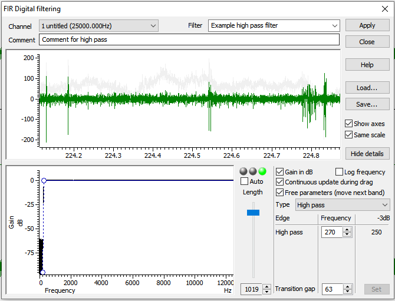
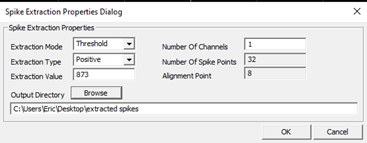

# Spike sorting

We'll cover how to spike sort using two programs: 1) [Spike2](https://ced.co.uk/products/spkovin) (written
by Tony Lapsansky) and 2) [Neuralynx](https://neuralynx.com/) (written by Eric Press).

The function of spike sorting is to isolate action potentials from the background voltage signal. These methods use the shape of the waveform to detect and distinguish the spiking activity of each neuron recorded by an electrode. 

## Spike2 

Written by Tony Lapsansky, February 24, 2023

These instructions assume that you have been given a Spike2 recording file (extension `.smrx`) and asked to spike sort.

Spike2 includes a detailed description of the program, accessible by clicking 
`Help` → `Index`

### File naming conventions: 

  * Use the name structure `YEARMODA_sequence_investigator`

  * Save data in the corresponding directory
    `“C:\InvestigatorName\ephys\YEAR-MO-DA”`
    
### Spike sorting with Spike2

1.  **Open the main `Spike2` file** for the recording. This file should have the
extension `.smrx`. 
2. **Apply a digital high pass filter**, if needed. Note: if the
data were collected with the high pass filter set at greater than 100 Hz (no LFP
signal) then proceed to step 3.
    *  Right click on the raw data channel (typically Ch1) and select `FIR
    Digital Filters…`. We want to use an FIR filter rather than an IIR filter as
    the latter can introduce a variable time lag in the resulting data (see
    Spike 2 `Help` → `Index` → `Digital Filter` for full explanation).
    *  Under the pull down menu for `Filter`, change the filter from
    `Example low pass filter` to `Example high pass filter`.
    *  Select the `Show Details` button in the bottom right.
    *  Adjust blue slider change the filter length. Shift the slider until 
    the coloured dots above the slider from red to yellow to green. This removes
    wobbles in the data. Use the minimum level (~1019) to achieve green. 
    Fine adjustments can be made just under the slider.
    
    *  Hit `Apply`
    *  Set `Destination` to the next available channel (typically Channel 4)
    *  Click `Okay`
    *  Close the filtering window. You are given the option to save
    the filter. This is unnecessary.
3.  **Setting the threshold for spike identification**
    *  Right click on the filtered channel and select `New WaveMark`
    *  Clear previous templates if any are present. To do so, select
        the trash can icon within each template. These may be present 
        from a previous session. 
    *  Locate your cursor position, indicated by the vertical dashed 
        line in the main window (typically found at time 0)
    *  Slide the dashed line horizontally through the trace to observe potential
        spikes as determined by the default upper and lower thresholds.
    *  Right click the upper bound marker (the upper horizontal
        dashed line in the `WaveMark` window) and select `Move Away`. We will
        rely on the lower bound to identify spikes for sorting, as the activity
        above baseline is typically closer in magnitude to the background.
    *  Slide the dashed line horizontally through the trace to observe potential
        spikes as determined by the lower threshold alone. 
    * Adjust the lower threshold to catch spikes of interest. This threshold 
        will vary based based on the distance between the electrode and the 
        neuron, the quality of the isolate, and the level of background noise. 
        Values between 50 mV and 200 mV are typical.Set the lower bound so that 
        spikes of interest are included and ambiguous spikes are excluded.
4.  **Designing the spike template**
    *  Move the cursor to a characteristic spike. In the upper window, you will
        see the provisional template. Click and hold on the trace in the upper 
        window and drag it to the first available spot in the lower, template window.
    *  To set parameters for spike sorting, click on the button just to the left 
        of the trash can icon (on the top half, upper right of the `WaveMark` 
        window). This is the "parameters dialog" button. This opens a template 
        settings window.
    *  For the line `Maximum amplitude change for a match` enter a value between 
        `10` and `20`. This will allow a spike that fits a template to vary in
        maximum amplitude by up to 10-20%.
    *  For the line `Remove the DC offset before template matching`,
        confirm that the box is checked. This means that Spike2 will account for
        abrupt shifts in the signal baseline before template matching. This is a
        stop-gap for any issues with the digital high pass filter.
    *  Click `OK`.
    
5.  **Spike sorting**
    *  Back in the `WaveMark` window, make sure that the box
        `Circular replay` is **unchecked**. If checked, spike sorting will loop
        indefinitely.
    *  Ensure that the vertical cursor on the main window is at time
        zero (or the first spike) so that no spikes are missed.
    *  Back in the `WaveMark` window, make sure that the box
        `Make templates` is **checked**. If unchecked, only spikes corresponding 
        to the provisional template will be identified. We want to let spike2
        help us to identify potential multi-unit activity.
    *  Hit the play button ▶️, which is called "run forward". Spike sorting will
        proceed for several minutes. Each identified spike will appear briefly
        in the `WaveMark` window and will be assigned to a template.
    
*In this image, I have selected options for `Overdraw` and `Show template limits`*

6.  **Merge, delete, and save templates**
    *   After spike sorting has completed, select `New Channel` on the `WaveMark`              window to place the spike sorted data in the next available channel 
        (typically, Channel 5)
    *  Close the existing `WaveMark` window.
    *  Right click on the **spike sorted channel** and select `Edit WaveMark`. 
    *  Within the `WaveMark` window, go the pull down menu `Analyse`
        and select `Principal components`. Select `OK`. This opens a
        window containing a principal component analysis of all spikes 
        colored by their assigned template.
    *  Rotate around all three axes to determine if there is one,
        two, or more clusters. In theory, each cluster corresponds to a single 
        neuron. Often, spikes are categorized into multiple templates, but 
        realistically correspond to the activity of a single neuron.
    *  Identify templates that should be deleted and those that
        should be merged. We will delete spikes corresponding to templates that 
        are sparse and peripheral.
    *  Delete the template(s) in the `WaveMark` window by selecting
        that template's trash can icon.
    *  Merge templates by dragging them into the same window
    *  Hit the `reclassify` button in the `WaveMark` window to commit these
       changes to the data in the main window.
    
*In this example, we have good evidence from the PCA to merge these five templates.*
    
7.  **Export the spike-sorted data**
    *  `File → Export As`
    *  Select `.mat` (`matlab` data)
    *  Use the same filename and location but with the `.mat`
        extension.
    *  Hit `Save`
    *  Select `Add` for `All Channels`
    *  Click `Export`
    *  Click `OK` (this will take several minutes)
    
*Note: May need to select an earlier MATLAB file convention to work with R.* 

## Neuralynx

Written by Eric Press, November 11, 2022

1.  Spike sorting database:
    1.  Check the column labelled `Sorting status` to find days of
        recording that are `cued` meaning they are ready to be sorted.
        Recordings are cued for spike sorting once information about
        the recording has been added to the database. This includes
        observations from the day's recording, whether the electrode
        position was moved from the previous recording, and the
        stimulus condition for each recording. The recordings are
        stored at the following location and are named/organized by
        date and time of recording:\
        `Computer/LaCie (D:)/Eric’s data/nlx_recordings`
2.  Filtering the raw traces (CSCs):
    1.  Use the `NlxCSCFiltering` tool on any Windows machine to run a
        band-pass filter on input `CSC` files.
    2.  Choose all the `CSC` files for a given recording, change the
        `PreAppend` field to `spfilt`, which stands for spike-filtered
        and adjust the `DSP` filtering fields to match the image to
        the right. This selects for frequencies in the raw traces
        where spikes will be found, but removes low frequency (LFP)
        and high frequency components of the traces.

3.  Examine the filtered traces:
    1.  Take a closer look at the filtered traces (Open in `Neuraview`
        on any Windows machine) and determine which channels are
        likely to have isolatable spikes and how many distinct spikes
        there might be. It helps to keep `Neuraview` open when setting
        thresholds in the next step.
4.  Spike detection from filtered traces:
    1.  Use the `CSCSpikeExtractor` tool on any Windows machine to
        detect spikes above or below a given µV) threshold. The units
        displayed in the program will be AdBitVolts which are simply
        10.92x from the µV value.
    2.  Based on the filtered traces, within `CSCSpikeExtractor`, set
        the spike extraction properties
        (`Spike Extraction -> Properties` OR `Ctrl+P`) as shown above.
        The `Extraction Value` is set to 10.92x the µV you chose by
        viewing the filtered traces.
    3.  Press `Ctrl+S` to extract spikes from the selected file at the
        desired settings. The resulting file will be placed in the
        `extracted spikes` filter on the `Desktop`.
    4.  Create subfolders in the recording folder for each threshold
        and move the extracted spikes at each threshold into the
        appropriate folder. These spike-detected files will be used
        for spike sorting in the next step.
    5.  **If it helps with detecting real spike waveforms while
        eliminating noise, run recordings through spike detection at
        multiple threshold (positive or negative) such that only all
        putative neurons are accounted for a minimal noise is
        detected.**

5.  Spike sorting:
    1.  Open the extracted spikes in `Spikesort3D` on either the
        Neuralynx machine or another Windows machine that has an
        active `SpikeSort3D` licence. You can also use `TeamViewer` to
        control the Neuralynx machine but this works much better with
        another Windows machine.
    2.  Press OK when the feature selection window appears. If you
        want to select alternate features to display, select them from
        the list provided. Sometimes it can be helpful to use PCA1 --
        3 in isolating neurons but often it makes things more
        challenging.
    3.  Using the 3D Plot, examine the clustering of spikes. Follow
        the image below to aid in interacting with the 3D plot (MB =
        the scroll wheel button i.e. middle mouse button). You can
        change the features displayed on each axis with `Q/W`, `A/S`,
        and `Z/X` respectively. Also, `Ctrl+P` brings up a window that
        allows you to change the size and opacity of points on the
        plot (I find `size = 2`, `alpha = 0.5` works well to improve
        visual definition of the clusters). If distinct clusters are
        difficult to see, find the combination of 3 features that
        produces the most noticeable clustering or the greatest spread
        of points in the space. The features displayed in the 3D plot
        are shown at the top left of the plot (i.e. X(3) Height \# \#
        \# \#). Use those features for the next step. 

    4.  Run `KlustaKwik` (`Cluster → Autocluster using KlustaKwik`)
        and select the 3 features that generate the most clearly
        separable clusters on the 3D view -- often, the first 3
        (`Peak`, `Valley`, `Energy`) do a decent job. Change the
        `MaxPossibleClusters` to `10` before pressing `Run`. The
        remaining settings should match the image below.

    5.  Following calculations, use the `Waveform` window and the 3D
        plot to group the distinct clusters into what you believe are
        waveforms produced by distinct neurons. Use the number keys to
        highlight distinct clusters and `Ctrl+M` to merge clusters
        together. `Ctrl+C` copies the selected cluster and can be used
        to split a cluster into 2 if you believe portions of the
        cluster belong to distinct putative neurons. This step takes
        some practice. You can use `Ctrl+Z` to undo only one move.
        Otherwise, you may need to exit without saving and start again
        at step 4. Save with `Ctrl+S` often and click OK to overwrite
        the file.
    6.  Once you are satisfied with the waveforms left, note how many
        there are, and whether it seems possible that some of the
        groups belong to the same neuron. Consider what you know about
        excitable membranes to make these decisions. Fill out the
        `Spike Sorting Database` with the information used to reach
        this point. This includes, the threshold(s), \# of clusters,
        \# of putative neurons (often 1 less than the \# of clusters
        because it would be a stretch to include the smallest
        amplitude waveform as a distinct, separable neuron), and any
        else to note from performing sorting.
    7.  Save each cluster to its own spike file
        (`File → Save Multiple Spike Files`)
    8.  Open the separate spike files you just created, along with the
        original filtered trace in `Neuraview`. Scroll along the
        recording and examine if the sorting you performed seems
        believable. Do the spikes in different rows really seem like
        they're different in the filtered trace? Do some spikes not
        seem like real spikes? If anything seems amiss, make the
        appropriate merges in `SpikeSort3D` before proceding.
    9.  Export the relevant data from the sorting. Perform the
        following:
        1.  `File → Save ASCII Timestamp Files`
        2.  `File → Save Multiple Spike Files`
        3.  `File → Save ASCII Avg Waveforms`
        4.  Also, save the file itself with `Ctrl+S`
    10. Lastly, bring up all the waveforms together on the waveform
        plot. Take a screenshot and save it to the folder where the
        extracted spikes (and now timestamps files) are stored.
6.  Moving sorted files to other locations:
    1.  Once a chunk of recordings have been sorted, copy/paste the
        entire recording file to Eric's orange 1TB storage drive
        (Lacie). Place them in the following folder:
        `Eric's data/sorted_recordings`
