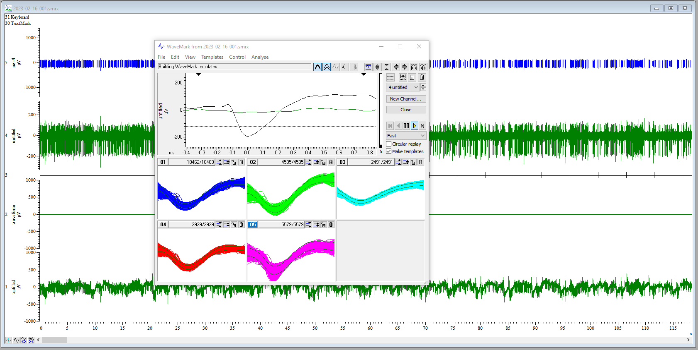
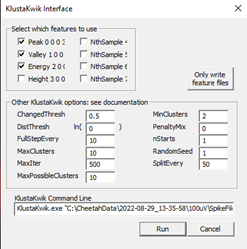

--- 
title: "Fundamental plots for electrophysiological data"
author: "Vikram B. Baliga"
date: "`r Sys.Date()`"
site: bookdown::bookdown_site
documentclass: book
bibliography: [book.bib, packages.bib]
url: https://flightlab.github.io/ephys_fundamental_plots/
# cover-image: path to the social sharing image like images/cover.jpg
description: |
  A walkthrough on how to produce fundamental plots from electrophysiological 
  data. Developed by the Alshuler Lab at the University of British Columbia.
link-citations: yes
links-as-notes: true
github-repo: flightlab/ephys_fundamental_plots
---

# About

Until this statement is deleted from this page, please consider everything you
see here a work in progress. Ultimately, this site will provide a walkthrough on
how to produce fundamental plots from  electrophysiological data. The content
was initialized using a [bookdown](https://bookdown.org/) template; accordingly,
as this site remains in a developmental stage, content from the template may
linger.

The original content written here is intended to instruct trainees in the
Altshuler Lab at the University of British Columbia to take raw recorded data
from electrophysiological examinations and then produce preliminary plots that
help characterize the recorded neural spike data.

To get started, please use the left navigation and work through chapters in
order.

🐢


## Citation {-}
TBD


## License {-}

The content of this work is licensed under CC-BY. For details please see 
[this web page](https://creativecommons.org/licenses/by/4.0/) or the LICENSE 
file in [flightlab/ephys_fundamental_plots](https://github.com/flightlab/ephys_fundamental_plots).

```{r bibs, include=FALSE}
# automatically create a bib database for R packages
knitr::write_bib(c(
  .packages(), 'bookdown', 'knitr', 'rmarkdown'
), 'packages.bib')
```

<!--chapter:end:index.Rmd-->

# Preface

## R packages & versioning

The R packages listed below will be necessary at some point over the course of
this book. I recommend installing them all now. The block of code below is
designed to first check if each of the listed packages is already installed on
your computer. If any is missing, then an attempt is made to install it from
CRAN. Finally, all of the packages are loaded into the environment.

```{r package_loading, echo=TRUE, message=FALSE, warning=FALSE}
## Specify the packages you'll use in the script
packages <- c("tidyverse",
              "zoo",
              "gridExtra",
              "R.matlab",
              "cowplot",
              "easystats",
              "circular",
              "splines",
              "MESS", ## area under curve
              "zoo" ## rolling means
)
## Now for each package listed, first check to see if the package is already
## installed. If it is installed, it's simply loaded. If not, it's downloaded 
## from CRAN and then installed and loaded.
package.check <- lapply(packages,
                        FUN = function(x) {
                          if (!require(x, character.only = TRUE)) {
                            install.packages(x, dependencies = TRUE)
                            library(x, character.only = TRUE)
                          }
                        }
)
```

I will use the `sessionInfo()` command to detail the specific versions of
packages I am using (along with other information about my R session). Please 
note that I am not suggesting you obtain exactly the same version of each 
package listed below. Instead, the information below is meant to help you assess
whether package versioning underlies any trouble you may encounter.

```{r package_versions, echo=FALSE}
print(sessionInfo())
```


## `%not_in%`

This guide will also rely on this handy function, which you should add to your
code:

``` {r not_in}
`%not_in%` <- Negate(`%in%`)
```

This simple operator allows you to determine if an element does not appear in a
target object.

<!--chapter:end:02-preface.Rmd-->

# Spike sorting

We'll cover how to spike sort using two programs: 1) [Spike2](https://ced.co.uk/products/spkovin) (written
by Tony Lapsansky) and 2) [Neuralynx](https://neuralynx.com/) (written by Eric Press).

The function of spike sorting is to isolate action potentials from the background voltage signal. These methods use the shape of the waveform to detect and distinguish the spiking activity of each neuron recorded by an electrode. 


## Spike2 

Written by Tony Lapsansky, February 24, 2023

These instructions assume that you have been given a Spike2 recording file (extension `.smrx`) and asked to spike sort.

Spike2 includes a detailed description of the program, accessible by clicking 
`Help` → `Index`


### File naming conventions: 

  * Use the name structure `YEARMODA_sequence_investigator`

  * Save data in the corresponding directory
    `“C:\InvestigatorName\ephys\YEAR-MO-DA”`
    
### Spike sorting with Spike2

1.  **Open the main `Spike2` file** for the recording. This file should have the
extension `.smrx`. 
2. **Apply a digital high pass filter**, if needed. Note: if the
data were collected with the high pass filter set at greater than 100 Hz (no LFP
signal) then proceed to step 3.
    *  Right click on the raw data channel (typically Ch1) and select `FIR
    Digital Filters…`. We want to use an FIR filter rather than an IIR filter as
    the latter can introduce a variable time lag in the resulting data (see
    Spike 2 `Help` → `Index` → `Digital Filter` for full explanation).
    *  Under the pull down menu for `Filter`, change the filter from
    `Example low pass filter` to `Example high pass filter`.
    *  Select the `Show Details` button in the bottom right.
    *  Adjust blue slider change the filter length. Shift the slider until 
    the coloured dots above the slider from red to yellow to green. This removes
    wobbles in the data. Use the minimum level (~1019) to achieve green. 
    Fine adjustments can be made just under the slider.
    
    *  Hit `Apply`
    *  Set `Destination` to the next available channel (typically Channel 4)
    *  Click `Okay`
    *  Close the filtering window. You are given the option to save
    the filter. This is unnecessary.
3.  **Setting the threshold for spike identification**
    *  Right click on the filtered channel and select `New WaveMark`
    *  Clear previous templates if any are present. To do so, select
        the trash can icon within each template. These may be present 
        from a previous session. 
    *  Locate your cursor position, indicated by the vertical dashed 
        line in the main window (typically found at time 0)
    *  Slide the dashed line horizontally through the trace to observe potential
        spikes as determined by the default upper and lower thresholds.
    *  Right click the upper bound marker (the upper horizontal
        dashed line in the `WaveMark` window) and select `Move Away`. We will
        rely on the lower bound to identify spikes for sorting, as the activity
        above baseline is typically closer in magnitude to the background.
    *  Slide the dashed line horizontally through the trace to observe potential
        spikes as determined by the lower threshold alone. 
    * Adjust the lower threshold to catch spikes of interest. This threshold 
        will vary based based on the distance between the electrode and the 
        neuron, the quality of the isolate, and the level of background noise. 
        Values between 50 mV and 200 mV are typical.Set the lower bound so that 
        spikes of interest are included and ambiguous spikes are excluded.
4.  **Designing the spike template**
    *  Move the cursor to a characteristic spike. In the upper window, you will
        see the provisional template. Click and hold on the trace in the upper 
        window and drag it to the first available spot in the lower, template window.
    *  To set parameters for spike sorting, click on the button just to the left 
        of the trash can icon (on the top half, upper right of the `WaveMark` 
        window). This is the "parameters dialog" button. This opens a template 
        settings window.
    *  For the line `Maximum amplitude change for a match` enter a value between 
        `10` and `20`. This will allow a spike that fits a template to vary in
        maximum amplitude by up to 10-20%.
    *  For the line `Remove the DC offset before template matching`,
        confirm that the box is checked. This means that Spike2 will account for
        abrupt shifts in the signal baseline before template matching. This is a
        stop-gap for any issues with the digital high pass filter.
    *  Click `OK`.
    
5.  **Spike sorting**
    *  Back in the `WaveMark` window, make sure that the box
        `Circular replay` is **unchecked**. If checked, spike sorting will loop
        indefinitely.
    *  Ensure that the vertical cursor on the main window is at time
        zero (or the first spike) so that no spikes are missed.
    *  Back in the `WaveMark` window, make sure that the box
        `Make templates` is **checked**. If unchecked, only spikes corresponding 
        to the provisional template will be identified. We want to let spike2
        help us to identify potential multi-unit activity.
    *  Hit the play button ▶️, which is called "run forward". Spike sorting will
        proceed for several minutes. Each identified spike will appear briefly
        in the `WaveMark` window and will be assigned to a template.
    
*In this image, I have selected options for `Overdraw` and `Show template limits`*

6.  **Merge, delete, and save templates**
    *   After spike sorting has completed, select `New Channel` on the `WaveMark`              window to place the spike sorted data in the next available channel 
        (typically, Channel 5)
    *  Close the existing `WaveMark` window.
    *  Right click on the **spike sorted channel** and select `Edit WaveMark`. 
    *  Within the `WaveMark` window, go the pull down menu `Analyse`
        and select `Principal components`. Select `OK`. This opens a
        window containing a principal component analysis of all spikes 
        colored by their assigned template.
    *  Rotate around all three axes to determine if there is one,
        two, or more clusters. In theory, each cluster corresponds to a single 
        neuron. Often, spikes are categorized into multiple templates, but 
        realistically correspond to the activity of a single neuron.
    *  Identify templates that should be deleted and those that
        should be merged. We will delete spikes corresponding to templates that 
        are sparse and peripheral.
    *  Delete the template(s) in the `WaveMark` window by selecting
        that template's trash can icon.
    *  Merge templates by dragging them into the same window
    *  Hit the `reclassify` button in the `WaveMark` window to commit these
       changes to the data in the main window.
    
*In this example, we have good evidence from the PCA to merge these five templates.*
    
7.  **Export the spike-sorted data**
    *  `File → Export As`
    *  Select `.mat` (`matlab` data)
    *  Use the same filename and location but with the `.mat`
        extension.
    *  Hit `Save`
    *  Select `Add` for `All Channels`
    *  Click `Export`
    *  Click `OK` (this will take several minutes)
    
*Note: May need to select an earlier MATLAB file convention to work with R.* 

## Neuralynx

Written by Eric Press, November 11, 2022

1.  Spike sorting database:
    1.  Check the column labelled `Sorting status` to find days of
        recording that are `cued` meaning they are ready to be sorted.
        Recordings are cued for spike sorting once information about
        the recording has been added to the database. This includes
        observations from the day's recording, whether the electrode
        position was moved from the previous recording, and the
        stimulus condition for each recording. The recordings are
        stored at the following location and are named/organized by
        date and time of recording:\
        `Computer/LaCie (D:)/Eric’s data/nlx_recordings`
2.  Filtering the raw traces (CSCs):
    1.  Use the `NlxCSCFiltering` tool on any Windows machine to run a
        band-pass filter on input `CSC` files.
    2.  Choose all the `CSC` files for a given recording, change the
        `PreAppend` field to `spfilt`, which stands for spike-filtered
        and adjust the `DSP` filtering fields to match the image to
        the right. This selects for frequencies in the raw traces
        where spikes will be found, but removes low frequency (LFP)
        and high frequency components of the traces.

3.  Examine the filtered traces:
    1.  Take a closer look at the filtered traces (Open in `Neuraview`
        on any Windows machine) and determine which channels are
        likely to have isolatable spikes and how many distinct spikes
        there might be. It helps to keep `Neuraview` open when setting
        thresholds in the next step.
4.  Spike detection from filtered traces:
    1.  Use the `CSCSpikeExtractor` tool on any Windows machine to
        detect spikes above or below a given µV) threshold. The units
        displayed in the program will be AdBitVolts which are simply
        10.92x from the µV value.
    2.  Based on the filtered traces, within `CSCSpikeExtractor`, set
        the spike extraction properties
        (`Spike Extraction -> Properties` OR `Ctrl+P`) as shown above.
        The `Extraction Value` is set to 10.92x the µV you chose by
        viewing the filtered traces.
    3.  Press `Ctrl+S` to extract spikes from the selected file at the
        desired settings. The resulting file will be placed in the
        `extracted spikes` filter on the `Desktop`.
    4.  Create subfolders in the recording folder for each threshold
        and move the extracted spikes at each threshold into the
        appropriate folder. These spike-detected files will be used
        for spike sorting in the next step.
    5.  **If it helps with detecting real spike waveforms while
        eliminating noise, run recordings through spike detection at
        multiple threshold (positive or negative) such that only all
        putative neurons are accounted for a minimal noise is
        detected.**

5.  Spike sorting:
    1.  Open the extracted spikes in `Spikesort3D` on either the
        Neuralynx machine or another Windows machine that has an
        active `SpikeSort3D` licence. You can also use `TeamViewer` to
        control the Neuralynx machine but this works much better with
        another Windows machine.
    2.  Press OK when the feature selection window appears. If you
        want to select alternate features to display, select them from
        the list provided. Sometimes it can be helpful to use PCA1 --
        3 in isolating neurons but often it makes things more
        challenging.
    3.  Using the 3D Plot, examine the clustering of spikes. Follow
        the image below to aid in interacting with the 3D plot (MB =
        the scroll wheel button i.e. middle mouse button). You can
        change the features displayed on each axis with `Q/W`, `A/S`,
        and `Z/X` respectively. Also, `Ctrl+P` brings up a window that
        allows you to change the size and opacity of points on the
        plot (I find `size = 2`, `alpha = 0.5` works well to improve
        visual definition of the clusters). If distinct clusters are
        difficult to see, find the combination of 3 features that
        produces the most noticeable clustering or the greatest spread
        of points in the space. The features displayed in the 3D plot
        are shown at the top left of the plot (i.e. X(3) Height \# \#
        \# \#). Use those features for the next step. 

    4.  Run `KlustaKwik` (`Cluster → Autocluster using KlustaKwik`)
        and select the 3 features that generate the most clearly
        separable clusters on the 3D view -- often, the first 3
        (`Peak`, `Valley`, `Energy`) do a decent job. Change the
        `MaxPossibleClusters` to `10` before pressing `Run`. The
        remaining settings should match the image below.

    5.  Following calculations, use the `Waveform` window and the 3D
        plot to group the distinct clusters into what you believe are
        waveforms produced by distinct neurons. Use the number keys to
        highlight distinct clusters and `Ctrl+M` to merge clusters
        together. `Ctrl+C` copies the selected cluster and can be used
        to split a cluster into 2 if you believe portions of the
        cluster belong to distinct putative neurons. This step takes
        some practice. You can use `Ctrl+Z` to undo only one move.
        Otherwise, you may need to exit without saving and start again
        at step 4. Save with `Ctrl+S` often and click OK to overwrite
        the file.
    6.  Once you are satisfied with the waveforms left, note how many
        there are, and whether it seems possible that some of the
        groups belong to the same neuron. Consider what you know about
        excitable membranes to make these decisions. Fill out the
        `Spike Sorting Database` with the information used to reach
        this point. This includes, the threshold(s), \# of clusters,
        \# of putative neurons (often 1 less than the \# of clusters
        because it would be a stretch to include the smallest
        amplitude waveform as a distinct, separable neuron), and any
        else to note from performing sorting.
    7.  Save each cluster to its own spike file
        (`File → Save Multiple Spike Files`)
    8.  Open the separate spike files you just created, along with the
        original filtered trace in `Neuraview`. Scroll along the
        recording and examine if the sorting you performed seems
        believable. Do the spikes in different rows really seem like
        they're different in the filtered trace? Do some spikes not
        seem like real spikes? If anything seems amiss, make the
        appropriate merges in `SpikeSort3D` before proceding.
    9.  Export the relevant data from the sorting. Perform the
        following:
        1.  `File → Save ASCII Timestamp Files`
        2.  `File → Save Multiple Spike Files`
        3.  `File → Save ASCII Avg Waveforms`
        4.  Also, save the file itself with `Ctrl+S`
    10. Lastly, bring up all the waveforms together on the waveform
        plot. Take a screenshot and save it to the folder where the
        extracted spikes (and now timestamps files) are stored.
6.  Moving sorted files to other locations:
    1.  Once a chunk of recordings have been sorted, copy/paste the
        entire recording file to Eric's orange 1TB storage drive
        (Lacie). Place them in the following folder:
        `Eric's data/sorted_recordings`

<!--chapter:end:03-spike_sorting.Rmd-->

# Quick version - condensed plots

Coming soon

<!--chapter:end:04_quick_plots.Rmd-->

# Data wrangling

Once data have been spike sorted, we are ready to begin working in
`R`. To get to a point where meaningful preliminary plots can be
produced, a few things need to be addressed:

1)  Labeling the time series of spike & photodiode data based on the
    stimulus that appears on screen (i.e., matching the log file to
    the data file). This includes labeling phases (like "blank",
    "stationary", and "moving") along with experimental metadata such
    as SF, TF, and stimulus orientation (direction).

2)  Re-organizing the spike & photodiode so that separate replicates
    of a stimulus run are uniquely labelled and then arranged
    together.

3)  Binning the data into 10- and 100-ms data sets, and then exporting
    CSVs of the unbinned, 10-ms-binned, and 100-ms-binned data. This
    will be highly useful for situations where you are handling
    multiple data files (e.g., from different recording days), in
    which case it is likely that your machine will not be able to
    store all objects in RAM.

> Before proceeding any further, please ensure you have installed and
> loaded all the necessary `R` packages as detailed in the Preface
> section of this guide.

## Import example file and metadata

We will use a recently-collected data file and its corresponding
metadata file to showcase the fundamentals of wrangling ephys data
into a more easily plot-able format.

### Identify files to import

The following code is based on the assumptions that: 

1)  Your files are stored in a directory entitled `/data` 

2)  The basename of each file (i.e., the name of the file, excluding the file
extension) is identical for each set of spike sorted data and corresponding
metadata log file (e.g., `2023-02-16_001.mat` and `2023-02-16_001.csv` have the
same basename, which is `2023-02-16_001`).

```{r list_files}
## List all files of each file type
csv_files <-
  list.files("./data", pattern = ".csv",
             full.names = TRUE)
mat_files <-
  list.files("./data", pattern = ".mat",
             full.names = TRUE)

## Generate metadata tibbles for each file type
csv_file_info <-
  tibble(
    csv_files = csv_files,
    ## Extract the basename by removing the file extension
    basename =  basename(csv_files) %>% str_remove(".csv"),
    ## NOTE: PLEASE ADJUST THE FOLLOWING LINE TO BE ABLE TO EXCTRACT OUT THE
    ## DATE BASED ON YOUR NAMING CONVENTION
    basedate =  basename(csv_files) %>% str_sub(start = 1, end = 12)
  )
mat_file_info <-
  tibble(
    mat_files = mat_files,
    ## Extract the basename by removing the file extension
    basename =  basename(mat_files) %>% str_remove(".mat"),
    ## NOTE: AGAIN, PLEASE ADJUST THE FOLLOWING LINE TO BE ABLE TO EXCTRACT OUT
    ## THE DATE BASED ON YOUR NAMING CONVENTION
    basedate =  basename(mat_files) %>% str_sub(start = 1, end = 12)
  )

## Matchmake between .MAT data and .CSV log files
csv_mat_filejoin <-
  inner_join(csv_file_info, mat_file_info, by = "basename") %>%
  ## OPTIONAL STEP: remove any rows where either the .MAT or .CSV is missing
  drop_na()

## Store a vector of basenames in the environment. This will become useful later
base_names <- csv_mat_filejoin$basename

## Your end products from this code block should look something like:
csv_mat_filejoin

## and:
base_names
```

### Data import and preliminary labeling

We will now use the `R.matlab` package to import the `.mat` file into
R and then label the spike and photodiode time series based on the
information in the `.csv` log file

Because `.mat` files can be large, data import can take several
minutes.

Please see in-line comments for further guidance

```{r data_import, message=FALSE, warning=FALSE}
## Set up empty vectors that will collect sets of replicates that we will be
## splitting up
metadata_sets <- NULL
meta_splits <- NULL
data_splits <- NULL
gc()

starttime <- Sys.time() ## Optional, will help you assess run time
for (i in 1:nrow(csv_mat_filejoin)) {

  ## Which file # are we working on?
  print(i)

  ## Set up temporary objects in which to eventually write data
  csv_data_sets <- NULL
  mat_data_sets <- NULL
  joined_data_sets <- NULL

  ## Import the matlab file. This may take some time
  mat_import <-
    R.matlab::readMat(csv_mat_filejoin[i,"mat_files"])

  ## Read in the corresponding csv log file
  csv_data_sets[[i]] <-
    read_csv(as.character(csv_mat_filejoin[i,"csv_files"]),
             show_col_types = FALSE) %>%
    ## Rename columns for convenience
    rename(
      Spatial_Frequency = `Spatial Frequency`,
      Temporal_Frequency = `Temporal Frequency`,
      Cycles_Per_Pixel = `Cycles Per Pixel`
    )

  ## The log file does not have time = 0, so set up a separate tibble to
  ## add this info in later. Some of the metadata will just be filler for now.
  initial <- tibble(
    Trial = "initialization",
    Spatial_Frequency =  csv_data_sets[[i]]$Spatial_Frequency[1],
    Cycles_Per_Pixel  =  csv_data_sets[[i]]$Cycles_Per_Pixel[1],
    Temporal_Frequency = csv_data_sets[[i]]$Temporal_Frequency[1],
    Direction  = csv_data_sets[[i]]$Direction[1],
    Time = 0.000
  )

  ## Find photodiode
  ## It is almost always in channel 2, but we should be sure to check before
  ## extracting automatically
  photod_default_channel <-
    mat_import[[stringr::str_which(names(mat_import), "Ch2")[1]]]
  if (!photod_default_channel[1][[1]][1] == "waveform") {
    warning("File ", i,": Photodiode channel identity uncertain")
  }

  ## Find spikes
  ## Similarly, spikes are almost always in channel 5, but we should check
  spikes_default_channel <-
    mat_import[[stringr::str_which(names(mat_import), "Ch5")[1]]]
  if("codes" %not_in% attributes(spikes_default_channel)$dimnames[[1]]) {
    warning("File ", i,": Sorted spikes channel identity uncertain")
  }
  ## If that worked, see if we can automatically determine the "times" and
  ## "codes" slot numbers
  times_location <-
    which(attributes(spikes_default_channel)$dimnames[[1]] == "times")
  codes_location <-
    which(attributes(spikes_default_channel)$dimnames[[1]] == "codes")

  ## Find matlab's stimulus change log
  stim_change_channel <-
    mat_import[[stringr::str_which(names(mat_import), "Ch3")[1]]]
  ## Each sweep should be 5 secs. We'll check that the median is 5
  ## If this results in an error, then the channel identity could be wrong, or
  ## there may have been an issue with sweep duration during the recording
  ## process
  if(!median(round(diff(stim_change_channel[[5]][,1]),0)) == 5) {
    warning("File ", i,": stim change channel identity uncertain")
  }

  ## Determine when the onset of motion occurred according to matlab
  first_moving_mat <-
    stim_change_channel[[5]][,1][1]
  ## Find the first "moving" phase in the log file
  first_moving_csv <-
    csv_data_sets[[i]] %>%
    filter(Trial == "moving") %>%
    select(Time) %>%
    slice(1) %>%
    as.numeric()
  ## Find the first "blank" phase in the log file
  first_blank <-
    csv_data_sets[[i]] %>%
    filter(Trial == "blank") %>%
    select(Time) %>%
    slice(1) %>%
    as.numeric()
  ## Compute the difference between these two
  first_mvbl_diff <- first_moving_csv - first_blank

  ## Check to see if the final row of the metadata is "moving" and truncate
  ## if not
  ## This can effectively be done by truncating after the final "moving" phase
  max_moving_sweep <-
    max(which(csv_data_sets[[i]]$Trial == "moving"))

  first_csv_tmp <-
    bind_rows(initial, csv_data_sets[[i]]) %>%
    ## Add 1 to max moving sweep since we tacked on "initial" in previous step
    ## Then slice to restrict any extraneous partial sweeps
    slice_head(n = (max_moving_sweep + 1)) %>%
    ## Add the first event time to "Time" and subtract first_mvbl_diff (~2 secs)
    ## What this does is shift the log csv's time stamping to match the matlab
    ## file's stim change channel's time stamping
    mutate(Time = Time + first_moving_mat - first_mvbl_diff - first_blank) %>%
    ## Make character version of Time for joining later
    ## This will be crucial for _join functions
    mutate(Time_char = as.character(round(Time,3)))

  ## Duplicate the initialization for ease of setting T0
  inception <-
    initial %>%
    mutate(Time_char = as.character(round(Time,3)))
  inception$Trial[1] <- "inception"

  ## Bind the initialization rows
  first_csv <-
    bind_rows(inception, first_csv_tmp)
  ## Compute stimulus end times
  first_csv$Stim_end <- c(first_csv$Time[-1], max(first_csv$Time) + 3)

  ## Get final time
  final_time <- first_csv$Stim_end[nrow(first_csv)]

  ## Extract photodiode data
  ## First generate a time sequence to match to the photodiode trace
  Time_vec <- seq(
    from = 0.0000,
    by = 1 / 25000,
    length.out = length(photod_default_channel[9][[1]][, 1])
  )
  ## The key thing is to get a character version of time from this
  Time_char_vec <- as.character(round(Time_vec, 3))

  ## Grab the photodiode data
  photod_full <-
    tibble(Photod =
             photod_default_channel[9][[1]][, 1])
  ## Add numeric time
  photod_full$Time <-
    seq(
      from = 0.0000,
      by = 1 / 25000,
      length.out = nrow(photod_full)
    )
  options(scipen = 999)
  photod_full <-
    photod_full %>%
    ## Add the character time
    add_column(Time_char = Time_char_vec) %>%
    ## Use the charcter time to define a group
    group_by(Time_char) %>%
    ## Then average the photodiode within
    summarise(Photod = mean(Photod)) %>%
    ungroup() %>%
    mutate(Time = round(as.numeric(Time_char), 3)) %>%
    arrange(Time) %>%
    filter(Time <= final_time)

  ## Extract all spike data
  all_spike_dat <-
    tibble(
      Time =
        spikes_default_channel[times_location][[1]][, 1],
      code =
        spikes_default_channel[codes_location][[1]][, 1]) %>%
    ## Characterize time, for purposes of joining later
    mutate(Time_char = as.character(round(Time, 3)))

  ## How many distinct neurons are there?
  cell_ids <- sort(unique(all_spike_dat$code))
  n_cells <- 1:length(cell_ids)

  if(length(n_cells) > 1) { ## if there's more than one distinct neuron
    all_spike_dat_tmp <-
      all_spike_dat %>%
      ## Group by identity of spiking neuron
      group_by(code) %>%
      ## Split into separate dfs, one per neuron
      group_split()

    ## Additional cells are labeled as "Spike_n"
    all_cells <- NULL
    for (j in n_cells) {
      #print(j)

      new_name = paste0("Spikes_", cell_ids[j])
      all_cells[[j]] <-
        all_spike_dat_tmp[[j]]

      ## Consolidate to 3 decimal places
      all_cells[[j]] <-
        all_cells[[j]] %>%
        group_by(Time_char) %>%
        summarise(code = mean(code)) %>%
        mutate(code = ceiling(code)) %>%
        ungroup() %>%
        mutate(Time = round(as.numeric(Time_char), 3)) %>%
        arrange(Time) %>%
        filter(Time <= final_time)

      names(all_cells[[j]])[match("code", names(all_cells[[j]]))] <-
        new_name
      ## Replace "j" with 1 to indicate presence/absence of spike rather than
      ## cell identity
      all_cells[[j]][new_name] <- 1

      ## If the identity is 1, replace "Spikes_1" with just "Spikes"
      if (new_name == "Spikes_1") {
        names(all_cells[[j]])[match(new_name, names(all_cells[[j]]))] <-
          "Spikes"
      }
    }

    ## Consolidate
    all_spike_dat <-
      all_cells %>%
      ## Tack on additional spike columns
      reduce(full_join, by = "Time_char") %>%
      arrange(Time_char) %>%
      ## Remove time.n columns but
      ## Do not remove Time_char
      select(-contains("Time.")) %>%
      ## Regenerate numeric time
      mutate(
        Time = as.numeric(Time_char)
      ) %>%
      select(Time, Time_char, Spikes, everything()) %>%
      filter(Time <= final_time)

  } else { ## If there's only 1 neuron
    all_spike_dat <-
      all_spike_dat %>%
      group_by(Time_char) %>%
      summarise(code = mean(code)) %>%
      mutate(code = ceiling(code)) %>%
      ungroup() %>%
      rename(Spikes = code) %>%
      mutate(Time = round(as.numeric(Time_char), 3)) %>%
      arrange(Time) %>%
      filter(Time <= final_time) %>%
      select(Time, Time_char, everything())
  }

  options(scipen = 999)
  mat_data_sets[[i]] <-
    ## Generate a time sequence from 0 to final_time
    tibble(
      Time = seq(from = 0, to = final_time, by = 0.001)
    ) %>%
    ## Character-ize it
    mutate(Time_char = as.character(round(Time, 5))) %>%
    ## Join in the photodiode data
    left_join(photod_full, by = "Time_char") %>%
    select(-Time.y) %>%
    rename(Time = Time.x) %>%
    arrange(Time) %>%
    ## Join in the spike data
    left_join(all_spike_dat, by = "Time_char") %>%
    select(-Time.y) %>%
    rename(Time = Time.x) %>%
    arrange(Time) %>%
    filter(Time <= final_time) %>%
    ## Replace NAs with 0 in the Spike columns only
    mutate(
      across(starts_with("Spikes"), ~replace_na(.x, 0))
    )

  ## Merge the matlab data with the metadata
  joined_one_full <-
    mat_data_sets[[i]] %>%
    ## Join by the character version of time NOT the numerical!!
    full_join(first_csv, by = "Time_char") %>%
    ## Rename columns for clarity of reference
    rename(Time_mat = Time.x,
           Time_csv = Time.y) %>%
    ## Convert character time to numeric time
    mutate(Time = round(as.numeric(Time_char), 3)) %>%
    ## Carry metadata forward
    mutate(
      Trial = zoo::na.locf(Trial, type = "locf"),
      Spatial_Frequency = zoo::na.locf(Spatial_Frequency, type = "locf"),
      Cycles_Per_Pixel  = zoo::na.locf(Cycles_Per_Pixel, type = "locf"),
      Temporal_Frequency = zoo::na.locf(Temporal_Frequency, type = "locf"),
      Direction = zoo::na.locf(Direction, type = "locf"),
      Time_csv = zoo::na.locf(Time_csv, type = "locf"),
      Stim_end = zoo::na.locf(Stim_end, type = "locf")
    ) %>%
    ## Calculate velocity
    mutate(
      Speed = round(Temporal_Frequency/Spatial_Frequency, 0),
      Log2_Speed = log2(Speed)
    )

  ## Add info to metadata
  metadata_one_full <-
    first_csv %>%
    mutate(
      Speed = round(Temporal_Frequency/Spatial_Frequency, 0),
      Log2_Speed = log2(Speed),
      Stim_end_diff = c(0, diff(Stim_end))
    )

  ## Some quality control checks
  ## What are the stim time differences?
  stimtime_diffs <- round(metadata_one_full$Stim_end_diff)[-c(1:2)]
  ## How many total reps were recorded?
  stimtime_reps <- length(stimtime_diffs)/3
  ## What do we expect the overall structure to look like?
  stimtime_expectation <- rep(c(1,1,3), stimtime_reps)
  ## Does reality match our expectations?
  if (!all(stimtime_diffs == stimtime_expectation)) {
    ## If you get this, investigate the file further and determine what went
    ## wrong
    print("stimtime issue; investigate")
  }

  ## Sometimes the final sweep gets carried for an indefinite amount of time
  ## before the investigator manually shuts things off. The following block
  ## truncates accordingly
  mark_for_removal <-
    which(round(metadata_one_full$Stim_end_diff) %not_in% c(1, 3))
  if (any(mark_for_removal == 1 | mark_for_removal == 2)) {
    mark_for_removal <- mark_for_removal[mark_for_removal > 2]
  }
  if (length(mark_for_removal) > 0) {
    metadata_sets[[i]] <-
      metadata_one_full %>%
      filter(Time < metadata_one_full[mark_for_removal[1],]$Time)
    joined_data_sets[[i]] <-
      joined_one_full %>%
      filter(Time_mat < metadata_one_full[mark_for_removal[1],]$Time)
  } else {
    metadata_sets[[i]] <-
      metadata_one_full
    joined_data_sets[[i]] <-
      joined_one_full
  }

  ## Organize the metadata for export in the R environment
  meta_splits[[i]] <-
    metadata_sets[[i]] %>%
    ## Get rid of the non-sweep info
    filter(!Trial == "inception") %>%
    filter(!Trial == "initialization") %>%
    ## Group by trial
    #group_by(Spatial_Frequency, Temporal_Frequency, Direction) %>%
    ## Split by trial group
    group_split(Spatial_Frequency, Temporal_Frequency, Direction)

  data_splits[[i]] <-
    joined_data_sets[[i]] %>%
    ## Get rid of the non-sweep info
    filter(!Trial == "inception") %>%
    filter(!Trial == "initialization") %>%
    ## Group by trial
    group_by(Spatial_Frequency, Temporal_Frequency, Direction) %>%
    ## Split by trial group
    group_split()

  ## Do some cleanup so large objects don't linger in memory
  rm(
    first_csv, inception, initial, mat_import, first_csv_tmp,
    photod_default_channel, spikes_default_channel, photod_full,
    all_spike_dat, all_spike_dat_tmp, all_cells,
    metadata_one_full, joined_one_full, joined_data_sets,
    csv_data_sets, mat_data_sets
  )
  message("File ", i, ": ", csv_mat_filejoin[i,"basename"], " imported")
  gc()
}

endtime <- Sys.time()
endtime - starttime ## Total elapsed time

## Tidy up how R has been using RAM by running garbage collection
gc()

## Name each data set according to the basename of the file
names(metadata_sets) <- csv_mat_filejoin$basename #base_names
names(meta_splits)   <- csv_mat_filejoin$basename #base_names
names(data_splits)   <- csv_mat_filejoin$basename #base_names

## Get organized lists of stimuli that were used
## This will ultimately be used for arranging data by stimuli in a sensible
## order
metadata_combos <- NULL
for (i in 1:length(metadata_sets)) {
  metadata_combos[[i]] <-
    metadata_sets[[i]] %>%
    ## Get unique stimulus parameters
    distinct(Spatial_Frequency, Temporal_Frequency, Speed, Direction) %>%
    arrange(Direction) %>%
    ## Sort by SF (smallest to largest)
    arrange(desc(Spatial_Frequency)) %>%
    mutate(
      ## Set a "plot_order" which provides a running order of stimuli
      plot_order = 1:length(meta_splits[[i]]),
      name = paste(Direction, "Deg,",  Speed, "Deg/s")
    )
}
names(metadata_combos) <- csv_mat_filejoin$basename #base_names

```

**What we now have is the following:**

-   `metadata_sets`: contains a `list` of `tibble`s (one per imported
    file), each of which comprises the stimulus log
-   `metadata_combos`: contains a `list` of `tibble`s (one per
    imported file), each of which comprises the stimulus log
    re-written in a preferred plotting order
-   `meta_splits`: a `list` of `list`s. The first level of the `list`
    corresponds to the file identities. Within each file's `list`,
    there is an additional set of `list`s, each of which contains a
    `tibble` with the log info for a specific stimulus combination.
    Essentially the same as `metadata_sets` but split up on a
    per-stimulus basis.
-   `data_splits`: another `list` of `list`s, arranged in the same
    hierarchical order as `meta_splits`. Each tibble herein contains
    the spike and photodiode data from the `matlab` file on a
    per-stimulus basis.

Note that since we are only using one example file, each of these
lists should only be 1 element long (with the latter two having
additional elements within the first element)

## Organizing replicates (required) and binning (optional)

It is common to record several different sweeps of a stimulus to
collect (somewhat) independent replicates of neural responses. The
primary task of this section will be to use the lists from the
previous section to gather & label replicates of the same stimulus.

A secondary task is to deal with binning, if desired (highly
recommended). Depending on the goals of plotting and/or analyses, it
may be wise to work with either unbinned spike data or to bin the data
at a convenient and sensible interval. I generally choose to work at
the following levels:

1.  Unbinned
2.  Bin size = 10 ms
3.  Bin size = 100 ms

**Important note:** Rather than provide separate code for each of
these 3 scenarios, I will provide one example. Bin size **must** be
declared beforehand -- please pay attention.

```{r reorganize_data}
## Set bin size here
## Units are in ms (e.g. 10 = 10ms)
bin_size = 10 ## 10 or 100 or 1 (1 = "unbinned")

slice_size = NULL
slicemin = NULL
slicemax = NULL
condition = NULL
if (bin_size == 10){
  slice_size <- 501
  slicemin <- 202
  slicemax <- 498
  condition <- "_binsize10"
} else if (bin_size == 100){
  slice_size <- 51
  slicemin <- 21
  slicemax <- 49
  condition <- "_binsize100"
} else if (bin_size == 1){
  slice_size <- NULL
  slicemin <- NULL
  slicemax <- NULL
  condition <- "_unbinned"
} else {
  stop("bin_size is non-standard")
}


all_replicate_data_reorganized <-
  vector(mode = "list", length = length(meta_splits))
name_sets <-
  vector(mode = "list", length = length(meta_splits))
gc()

starttime <- Sys.time()
for (i in 1:length(meta_splits)){

  ## i = file number
  print(i)

  ## We'll need to collect data at a per-stimulus level and on a per-replicate
  ## level within the per-stimulus level
  ## "j" will be used to designate a unique stimulus
  ## We'll first create an empty object in which to collect stimulus-specific
  ## data
  replicate_data_reorganized <- NULL
  ## For each of j unique stimuli...
  for (j in 1:length(meta_splits[[i]])) { # j = {direction,speed}
    ## Isolate the j-th data
    d <- data_splits[[i]][[j]]
    ## And the j-th log data
    m <- meta_splits[[i]][[j]] %>%
      group_by(Trial) %>%
      ## Label separate replicates
      mutate(Replicate = row_number())

    ## Extract a stimulus label to a name_set that will be used later
    name_sets[[i]][[j]] <-
      paste(m$Direction[1], "Deg,",  m$Speed[1], "Deg/s")

    ## Set up a temporary object to deal with per-replicate data
    replicates_ordered <- NULL
    ## "k" will be used to designate replicate number
    for (k in 1:max(m$Replicate)){
      tmp <-
        m %>%
        filter(Replicate == k)

      ## If you have a complete replicate (i.e., blank, stationary, moving)
      if (nrow(tmp) == 3 ) {
        ## Grab the specific data
        doot <-
          d %>%
          filter(Time >= min(tmp$Time)) %>%
          filter(Time <= max(tmp$Stim_end))
        ## Add bin information
        doot$bin <-
          rep(1:ceiling(nrow(doot)/bin_size), each = bin_size)[1:nrow(doot)]

        if (bin_size == 1) {
          ## IF YOU ARE NOT BINNING, RUN THIS:
          replicates_ordered[[k]] <-
            doot %>%
            mutate(
              ## Construct a standardized time within the sweep
              Time_stand = Time_mat - min(Time_mat),
              ## When does the sweep begin
              Time_begin = min(Time_mat),
              ## When does the sweep end
              Time_end = max(Time_mat),
              ## Delineate the end of the blank phase
              Blank_end = tmp$Stim_end[1] - min(Time_mat),
              ## Delineate the end of the stationary phase
              Static_end = tmp$Stim_end[2] - min(Time_mat),
              ## Label the replicate number
              Replicate = k
            ) %>%
            ## Bring stim info to first few columns
            select(Speed, Spatial_Frequency, Temporal_Frequency, Direction,
                   everything()) %>%
            ## Just in case there some hang over
            filter(Time_stand >= 0)
        } else { ## IF YOU ARE BINNING, RUN THIS:

          ## First grab time and meta info
          time_and_meta <-
            doot %>%
            ## WITHIN EACH BIN:
            group_by(bin) %>%
            summarise(
              ## Label the trial
              Trial = first(Trial),
              ## Midpoint of bin
              Time_bin_mid = mean(Time_mat),
              ## Bin beginning
              Time_bin_begin = min(Time_mat),
              ## Bin end
              Time_bin_end = max(Time_mat),
              ## Spike rate = sum of spikes divided by elapsed time
              Spike_rate = sum(Spikes) / (max(Time_mat) - min(Time_mat)),
              Photod_mean = mean(Photod)
            )

          ## Now deal with Spike_N columns
          hold_spike_n <-
            doot %>%
            select(starts_with("Spikes_")) %>%
            add_column(bin = doot$bin) %>%
            add_column(Time_mat = doot$Time_mat) %>%
            group_by(bin) %>%
            summarise(across(starts_with("Spikes_"),
                             ~ sum(.x) / (max(Time_mat) - min(Time_mat))))

          ## Put them together
          replicates_ordered[[k]] <-
            time_and_meta %>%
            left_join(hold_spike_n, by = "bin") %>%
            mutate(
              ## Add in metadata (following same definitions above)
              Time_stand = Time_bin_mid - min(Time_bin_mid),
              Blank_end = tmp$Stim_end[1] - min(Time_bin_mid),
              Static_end = tmp$Stim_end[2] - min(Time_bin_mid),
              Spatial_Frequency = m$Spatial_Frequency[1],
              Temporal_Frequency = m$Temporal_Frequency[1],
              Speed = m$Speed[1],
              Direction = m$Direction[1],
              Replicate = k
            ) %>%
            ## Bring stim info to first few columns
            select(Speed, Spatial_Frequency, Temporal_Frequency, Direction,
                   everything()) %>%
            ## Just in case there some hang over
            filter(Time_stand >= 0) %>%
            filter(bin < slice_size + 1)

          rm(time_and_meta, hold_spike_n)
        }
      }
      }

    ## Now insert it within the collector of per-stimulus data
    replicate_data_reorganized[[j]] <-
      replicates_ordered %>%
      bind_rows()

    ## Now insert it within the overall data collector
    all_replicate_data_reorganized[[i]][[j]] <-
      replicate_data_reorganized[[j]]

    ## Toss out temporary objects and clean up
    rm(replicates_ordered, d, m, tmp)
    gc()
  }
}
endtime <- Sys.time()
endtime - starttime
gc()

for (i in 1:length(all_replicate_data_reorganized)) {
  for (j in 1:length(all_replicate_data_reorganized[[i]])) {
    names(all_replicate_data_reorganized[[i]])[[j]] <- name_sets[[i]][[j]]
  }
}
names(all_replicate_data_reorganized) <- csv_mat_filejoin$basename #base_names

```

At the end of this process, here is how `all_replicate_data_reorganized[[1]]`
should look:

```{r}
## How long is this list?
length(all_replicate_data_reorganized[[1]])

## This object contains 48 individual tibbles. Here's an example of one
## pulled at random
all_replicate_data_reorganized[[1]][sample(1:48, size = 1)]

## To consolidate this, you can use bind_rows()
all_replicate_data_reorganized[[1]] %>% bind_rows
```

**Bear in mind that I am specifically describing
`all_replicate_data_reorganized[[1]]`, NOT `all_replicate_data_reorganized`.**
This is because `all_replicate_data_reorganized` will itself be a `list` that is
as long as the number of distinct data files you are feeding into all of the
above. Since there is only 1 example file, `all_replicate_data_reorganized` is a
`list` that is only 1 entry long at its top level, and within that `list` is set
of 48 `list`s (one per distinct stimulus), each of which contains a
stim-specific `tibble` of data.

## Data export

It is highly recommended that you export
`all_replicate_data_reorganized`. I generally export
`all_replicate_data_reorganized` as a separate `csv` file for each of
the following conditions:

1.  Unbinned
2.  Bin size = 10 ms
3.  Bin size = 100 ms

This section will provide code to export each of the above, assuming
you used those bin sizes in the previous section. Please be sure to
change file naming conventions and other parameters in the event you
chose a different `bin_size` in the previous section.

```{r export_csv, eval=F, echo=T}
## Declare export destination
export_path <- "./data/"
## The "condition" will be appended to the file name.

## Export each tibble within all_replicate_data_reorganized
for (i in 1:length(all_replicate_data_reorganized)) {
  print(i)
  dat <-
    all_replicate_data_reorganized[[i]] %>%
    bind_rows()
  write_csv(
    dat,
    file =
      paste0(
        export_path,
        names(all_replicate_data_reorganized)[i],
        condition,
        ".csv"
      )
  )
  rm(dat)
}

```

Re-run the above chunk of code per condition you seek to export. For me, this
process creates 3 files: `2023-02-16_001_unbinned.csv`,
`2023-02-16_001_binsize10.csv`, and `2023-02-16_001_binsize100.csv`.

🐢

<!--chapter:end:05-data_wrangling.Rmd-->

# Raster and mean spike rate plots

## Data sets

This section will rely on some of the unbinned and binned data we
exported in final steps of the previous section. We'll start by
loading in information

```{r plotting_data_sets, message=FALSE, warning=FALSE}
## File paths and basenames of _unbinned.csv files
unbinned_filelist <-
  list.files("./data/", pattern = "_unbinned.csv",
             full.names = TRUE)
unbinned_basenames <-
  unbinned_filelist %>%
  str_remove("./data/") %>%
  str_remove("_unbinned.csv")

## File paths and basenames of _binsize10.csv files
bin10_filelist <-
  list.files("./data/", pattern = "_binsize10.csv",
             full.names = TRUE)
bin10_basenames <-
  bin10_filelist %>%
  str_remove("./data/") %>%
  str_remove("_binsize10.csv")

## File paths and basenames of _binsize100.csv files
bin100_filelist <-
  list.files("./data/", pattern = "_binsize100.csv",
             full.names = TRUE)
bin100_basenames <-
  bin100_filelist %>%
  str_remove("./data/") %>%
  str_remove("_binsize100.csv")
```

You should have something similar to the following:

```{r confirm_data_paths}
unbinned_filelist; unbinned_basenames; bin10_filelist; bin10_basenames; bin100_filelist; bin100_basenames
```

## Raster plot

Here is an example of a raster plot, using the wrangled data generated
in the previous section. This type of plot shows the timing of spike
events within each replicate sweep, and for our purposes, we'll
produce a view of this for each of the various stimulus conditions

It is important to note that we will need unbinned data for this. This
is because a raster plot shows discrete spiking events through the
course of a time sweep.

Here, we will use `ggplot` to create a plot with:

1.  Data sub-plotted by stimulus (i.e., Speed and Direction)
2.  Standardized sweep time on the x-axis, with delineation among
    blank, stationary, and moving phases using red, yellow, and green
    undershading. The y-axis will indicate replicate number
3.  A black tick each time a spike is observed. Absence of black tick = no 
    observed spike

```{r make_rasters, message=FALSE, warning=FALSE}
## For each unbinned file, generate a raster plot
rasterplots <- NULL
for (i in 1:length(unbinned_filelist)) {
  ## Read in the data
  unbinned_data <-
    read_csv(unbinned_filelist[i]) %>%
    as_tibble()

  ## determine the max number of replicates
  max_reps <- max(unbinned_data$Replicate)

  ## Generate the code for the ggplot and save it as rasterplots[[i]]
  rasterplots[[i]] <-
    unbinned_data %>%
    ## Remove any rows where spiking does not occur in the Spikes column
    filter(Spikes == 1) %>%
    ## Convert Trial and Speed into factors and specify their level ordering
    ## This will make it easier to get the subplots in the order we want them
    mutate(
      Trial = factor(Trial,
                     levels = c("blank", "stationary", "moving")),
      Speed = factor(Speed,
                     levels = c(1024, 644, 407, 256, 128, 64, 32, 16, 8, 4))) %>%
    ggplot(aes(x = Time_stand, y = Replicate)) +
    ## The next three blocks will undershade each subplot according to stimulus
    ## phase (i.e., blank, stationary, moving)
    annotate("rect",
             xmin = 0, xmax = first(unbinned_data$Blank_end),
             ymin = 0.5, ymax = max_reps + 0.5,
             alpha = 0.075, color = NA, fill = "red") +
    annotate("rect",
             xmin = first(unbinned_data$Blank_end),
             xmax = first(unbinned_data$Static_end),
             ymin = 0.5, ymax = max_reps + 0.5,
             alpha = 0.075, color = NA, fill = "darkgoldenrod1") +
    annotate("rect",
             xmin = first(unbinned_data$Static_end), xmax = 5,
             ymin = 0.5, ymax = max_reps + 0.5,
             alpha = 0.075, color = NA, fill = "forestgreen") +
    ## Up to 10 replicates were used, so we will force the y-axis to go to 10
    scale_y_continuous(
      limits = c(0.5, max_reps + 0.5),
      expand = c(0, 0),
      breaks = c(max_reps/2, max_reps)
    ) +
    ## There are multiple ways to plot a spike event. Since 100% of the rows in
    ## this filtered data set are spike events, we can simply plot a symbol at
    ## each time (Time_stand) that appears in the data. The `|` symbol is a good
    ## choice.
    geom_point(pch = '|', size = 1.5) +
    xlab("Time (sec)") +
    ggtitle(paste0(unbinned_basenames[1], " raster")) +
    ## Use facet_grid() to create a grid of subplots. Rows will correspond to
    ## Speeds, and columns correspond to Directions
    facet_grid(rows = vars(Speed), cols = vars(Direction)) +
    theme_classic() +
    theme(legend.position = 'none',
          panel.spacing = unit(0.1, "lines"))

  ## Clean up
  rm(unbinned_data)
}
```

`rasterplots` is now an object in the environment that contains one plot 
per imported data file. To plot, simply call the index of the file you
wish to see. Since we only have 1 example file, we'll showcase the only
plot here:

```{r rasterplot, message=FALSE, warning=FALSE, out.height="600px", out.width="800px"}
## Here's the raster plot
rasterplots[[1]]
```


## Mean spike rate plots

To visualize the mean spike rate over the course of the stimulus
sweep, I typically elect to use 100ms-binned data. This format of the
data allows me to see the salient spike rate patterns without focusing
on every little variation in the data.

Here, we will use `ggplot` to create a plot with:

1.  Data sub-plotted by stimulus (i.e., Speed and Direction)
2.  Standardized sweep time on the x-axis, with delineation among
    blank, stationary, and moving phases
3.  A black line to indicate the mean spike rate, along with a grey
    ribbon to show +/- 1 S.E.M.

```{r make_msrs, message=FALSE, warning=FALSE, out.height="600px", out.width="800px"}
## For each 100-ms binned file, generate a mean spike plot
bin100_msr_plots <- NULL
for (i in 1:length(bin100_filelist)) {
  ## Read in the data
  bin100_data <-
    read_csv(bin100_filelist[i]) %>%
    as_tibble()

  ## Compute SE and other metrics and add this to our data set
  dataslices_100 <-
    bin100_data %>%
    ## Split by direction and speed, because we will use those to define each
    ## subplot
    group_split(Direction, Speed) %>%
    ## Group by time bin
    purrr::map(group_by, bin) %>%
    ## Within each time bin, compute the following:
    purrr::map(transmute,
               ## first() can be used for metadata such as Speed or Direction
               Speed = first(Speed),
               Direction = first(Direction),
               ## I generally compute the mean within each bin for the following:
               Time_stand = mean(Time_stand),
               Blank_end = mean(Blank_end),
               Static_end = mean(Static_end),
               Mean_spike_rate = mean(Spike_rate),
               ## To get SE, divide s.d. by the square root of sample size
               Spike_rate_SE = sd(Spike_rate)/sqrt(n()),
               Mean_photod_rate = mean(Photod_mean),
               ## SE of photodiode
               Photod_SE = sd(Photod_mean)/sqrt(n())
    ) %>%
    purrr::map(ungroup) %>%
    bind_rows() %>%
    ## We'll manually set the levels of the "Speed" column to ensure they plot in
    ## a desired order (fastest = highest, slowest = lowest)
    mutate(across(
      Speed,
      factor,
      levels = c("1024", "644", "407", "256", "128", "64", "32", "16", "8", "4")
    ))

  ## Generate the mean spike rate plot using ggplot
  bin100_msr_plots[[i]] <-
    dataslices_100 %>%
    ## The same code block can be used to generate either the mean spike rate
    ## (shown below) or photodiode trace (commented out)
    ggplot(aes(x = Time_stand,
               y = Mean_spike_rate #Mean_photod_rate
    )) +
    ## We'll actually start by placing red, yellow, and green vertical lines to
    ## distinguish between blank, stationary, and moving phases
    ## This comes first so that it is the bottom-most layer and doesn't obstruct
    ## the data
    geom_vline(xintercept = 0, col = "red") +
    geom_vline(xintercept = first(dataslices_100$Blank_end),
               col = "darkgoldenrod1") +
    geom_vline(xintercept = first(dataslices_100$Static_end),
               col = "forestgreen") +
    ## We'll use `geom_ribbon()` to shade in the SE traces
    geom_ribbon(aes(
      ymin = Mean_spike_rate - Spike_rate_SE,
      ymax = Mean_spike_rate + Spike_rate_SE
      # ymin = Mean_photod_rate - Photod_SE,
      # ymax = Mean_photod_rate + Photod_SE
    ),
    fill = "grey80") +
    ## `geom_line()` will be used to draw the mean spike rate itself on top of
    ## the SE traces
    geom_line(linewidth = 0.05) +
    ## Add a title to help us know what cell this is
    ggtitle(bin10_basenames[1]) +
    xlab("Time (sec)") +
    ylab("Spike rate (spikes/sec)") +
    ## To sub-plot by Speed and Direction, I typically use `facet_grid()`. This
    ## method allows me to explicitly declare what the row- and column-wise
    ## grouping variables are
    facet_grid(rows = vars(Speed), cols = vars(Direction)) +
    theme_classic()

  rm(bin100_data, dataslices_100)
}
```


`bin100_msr_plots` is now an object in the environment that contains one plot 
per imported data file. To plot, simply call the index of the file you
wish to see. Since we only have 1 example file, we'll showcase the only
plot here:

```{r msr_plot, message=FALSE, warning=FALSE, out.height="600px", out.width="800px"}
## Here's the spike rate plot
bin100_msr_plots[[1]]
```


## Export to PDF

Should you elect to either of these plots a `PDF`, here is an example
of what you could do.

```{r example_pdf_export, eval=FALSE}
## Use the `pdf()` function to start the graphics device driver for producing
## PDFs
## Aspects such as page size and centering mode can be adjusted
pdf(
  file = "./path/to/directory/2023-02-16_001_raster.pdf",
  width = 10.5,
  height = 8,
  title = "2023-02-16_001 raster",
  paper = "USr",
  bg = "white",
  pagecentre = TRUE,
  colormodel = "srgb"
)
## Now add the plot to the PDF simply by calling plot()
plot(rasterplots[1])
## To declare an end to this PDF writing session, use `dev.off()`
dev.off()
```

<!--chapter:end:06-raster_mean_spike_rate.Rmd-->

# Direction tuning

This type of plot is so fundamental to the examination of LM and nBOR,
it deserves a chapter unto itself. The majority of the information
going into polar tuning plots is the same as those in previous
chapters. Unlike raster and mean spike rate plots, however, direction
tuning plots require deliberate choices from the investigator to
delineate a "baseline" spike rate to be distinguished from the spike
rate during the stimulus of interest (in our case, global motion
patterns). The conditions that define the baseline and motion epochs
require explicit definitions form the investigator.

Seeing the mean spike rate plot from the previous chapter will help
give context to some of these decisions **[INSERT IMAGE HERE]**.
Importantly, at the onset of the blank and the stationary phases, it
is common to observe an initial transient response -- a sharp increase
in the spike rate of the neuron -- followed by a return to a steady
state.

For our purposes, the baseline will be defined as the steady state
response during the stationary phase of the stimulus. We will collect
this steady state response rate across all stimulus conditions (i.e.,
varying combos of speed and direction), and will simply average all of
those response rates to attain our baseline rate (and its SEM). Please
note that it is up to the investigator to determine if this definition
is appropriate, especially if other stimulus presentations are being
used.

For the "motion epoch", I will use a few different definitions. Some
of these conventions are informed by previous work (e.g., Smyth et al.
2022), whereas others are just based on a rough approximation of what
may be appropriate for these data. The definitions of the motion
epochs will be:

1.  The entire 3-sec motion epoch
2.  The "initial transient" phase: 40-200ms after the onset of
    motion (as used in Smyth et al. 2022)
3.  The "steady state" phase: 1500-3000ms after the onset of motion,
    a.k.a., the second half of the motion stimulus (as used in Smyth
    et al. 2022)
4.  The first 500 ms of the motion phase. This is an arbitrary
    definition for demonstrative purposes only, but somewhat informed
    by observing the patterns in the mean spike rate plot

As we construct polar plots, two additional aspects will be included
in the plots:

1.  The "preferred direction" of the neuron, as defined by the vector
    sum method **[insert citation]**. This will be shown as a single 
    grey line in the plot that indicates the preferred direction. Bear
    in mind that this value may not always be meaningful, particularly
    in cases of multi-modal responses.
2.  The Sensitivity Index (SI) of the neuron, as defined by
    **[citation]**. This metric calculates the narrowness of tuning.
    An SI of 1 indicates strong response to a single direction whereas
    0 indicates similar response across all investigated directions.

## Data import and baseline rate measurement

We will use the 10-ms binned data for these examples. We'll read in the
file and then extract the baseline rate as defined above. The code will be 
written such that it can batch-process more than one file if desired.

```{r polar_import_and_baseline}
bin10_data <- NULL
polar_directions <- NULL
baseline_summary_df <- NULL
for (i in 1:length(bin10_filelist)) {
  ## Read in the data
  bin10_data[[i]] <-
    read_csv(bin10_filelist[i], show_col_types = FALSE) %>%
    as_tibble() %>%
    ## Again, we will set Speed as an ordered factor to help control plotting
    ## later on
    mutate(across(
      Speed,
      factor,
      levels = c("4", "8", "16", "32", "64", "128", "256", "407", "644", "1024")
    ))

  ## Determine unique directions
  polar_directions[[i]] <-
    bin10_data[[i]]$Direction %>%
    unique()

  ## Extract all rows corresponding to our desired baseline epoch
  baseline_df <-
    bin10_data[[i]] %>%
    filter(Time_stand >= Blank_end + 0.5) %>% ## 0.5 sec after blank end
    filter(Time_stand <= Static_end - 0.05)   ## 0.05 sec before static end

  ## Compute the mean baseline
  global_base <- mean(baseline_df$Spike_rate)
  ## Compute the SE
  global_base_se <-
    sd(baseline_df$Spike_rate) / sqrt(length(baseline_df$Spike_rate)
    )

  ## Construct a summary data frame
  baseline_summary_df[[i]] <-
    baseline_df %>%
    group_by(Speed) %>%
    summarize(
      speed_specific_baseline = mean(Spike_rate),
      speed_specific_baseline_se = sd(Spike_rate)/sqrt(length(Spike_rate)),
      global_baseline = global_base,
      global_baseline_se = global_base_se
    )

  ## This tibble contains speed-specific baselines (and SE) along with the
  ## global mean baseline (and SE)
  baseline_summary_df[[i]]
}
```

## Using the full 3-sec motion epoch

This will be referred to as the "naive" approach in the code below

```{r naive, fig.height=3, fig.width=10}
## global baseline values, full 3-sec motion period
bin10_polar_naive <- NULL
for (i in 1:length(bin10_filelist)) {
  naive_df  <-
    bin10_data[[i]]  %>%
    filter(Time_stand > Static_end) %>%
    group_by(Speed, Direction, Replicate) %>%
    summarize(
      mean_spike_rate = mean(Spike_rate)
    )
  naive_360 <-
    naive_df %>%
    filter(Direction == 0) %>%
    transmute(
      Speed = Speed,
      Direction = 360,
      Replicate = Replicate,
      mean_spike_rate = mean_spike_rate)
  naive_vecsum_df <-
    naive_df %>%
    ungroup() %>%
    drop_na(mean_spike_rate) %>%
    group_split(Speed) %>%
    map(group_by, Direction) %>%
    ## NOTE: FOLLOWING THE JNP AND CB PAPERS, WE ARE SUBTRACTING BASELINE HERE AND
    ## THEN IF ANY AVERAGED FIRING RATES ARE NEGATIVE, THEY ARE SHIFTED SO THE
    ## LOWEST ONE IS ZERO. THE GENERATED PLOTS STILL SHOW NON-BASELINE-SUBTRACTED
    ## FIRING RATES (AND BASELINE AS A RED RING), BUT COMPUTATION OF VECTOR SUM
    ## AND SI HAVE BEEN BASELINE SUBTRACTED (AND THE ENTIRE CURVE IS SHIFTED
    ## UPWARDS IF ANY PART IS NEGATIVE)
    map(
      summarize,
      mean_spike_rate = mean(mean_spike_rate) - unique(baseline_summary_df[[i]]$global_baseline),
      Speed = first(Speed)
    ) %>%
    map(mutate,
        mean_spike_rate =
          case_when(
            min(mean_spike_rate) < 0 ~ mean_spike_rate + abs(min(mean_spike_rate)),
            TRUE ~ mean_spike_rate
          )) %>%
    map(
      transmute,
      x = cos(Direction * pi / 180) * mean_spike_rate,
      y = sin(Direction * pi / 180) * mean_spike_rate,
      Speed = first(Speed)
    ) %>%
    map(summarise,
        x = mean(x),
        y = mean(y),
        Speed = first(Speed)) %>%
    map(transmute,
        vector_sum = (atan2(y, x) * 180 / pi) %% 360,
        Speed = first(Speed)) %>%
    bind_rows()
  naive_si_df <-
    naive_df %>%
    ungroup() %>%
    drop_na(mean_spike_rate) %>%
    group_split(Speed) %>%
    map(group_by, Direction) %>%
    map(
      summarize,
      mean_spike_rate = mean(mean_spike_rate) - unique(baseline_summary_df[[i]]$global_baseline),
      Speed = first(Speed)
    ) %>%
    map(mutate,
        mean_spike_rate =
          case_when(
            min(mean_spike_rate) < 0 ~ mean_spike_rate + abs(min(mean_spike_rate)),
            TRUE ~ mean_spike_rate
          )) %>%
    map(
      transmute,
      a = (sin(Direction * pi / 180) * mean_spike_rate),
      b = (cos(Direction * pi / 180) * mean_spike_rate),
      c = mean(mean_spike_rate),
      Speed = first(Speed)
    ) %>%
    map(
      summarise,
      a = mean(a),
      b = mean(b),
      c = mean(c),
      Speed = first(Speed)
    ) %>%
    map(transmute,
        si = sqrt(a ^ 2 + b ^ 2) / c,
        Speed = first(Speed)) %>%
    bind_rows()

  naive_data <-
    naive_df %>%
    bind_rows(naive_360) %>%
    left_join(naive_vecsum_df, by = "Speed") %>%
    left_join(naive_si_df, by = "Speed") %>%
    drop_na(mean_spike_rate)
  naive_max_y <- max(naive_data$mean_spike_rate)

  bin10_polar_naive[[i]] <-
    naive_data %>%
    left_join(baseline_summary_df[[i]], by = "Speed") %>%
    ggplot(aes(x = Direction, y = mean_spike_rate)) +
    geom_ribbon(aes(
      x = Direction,
      ymin = global_baseline - global_baseline_se,
      ymax = global_baseline + global_baseline_se
    ),
    fill = "darkgoldenrod1") +
    stat_smooth(method = "glm",
                formula = y ~ ns(x, length(polar_directions[[i]])),
                linewidth = 0.3, color = "forestgreen") +
    geom_point(color = "#333132") +
    geom_label(aes(label = round(si, 2) , x = 315, y = naive_max_y * 1.2),
               size = 3) +
    geom_vline(aes(xintercept = vector_sum), colour = "grey30",
               size = 0.75) +
    coord_polar(direction = 1, start = pi / 2) +
    scale_x_continuous(
      breaks = c(0, 90, 180, 270),
      expand = c(0, 0),
      limits = c(0, 360)
    ) +
    scale_y_continuous(
      #trans = "sqrt",
      limits = c(0, naive_max_y * 1.2)
    ) +
    facet_grid(cols = vars(Speed)) +
    ggtitle("Full 3-sec motion") +
    ylab("Spike rate (spikes/sec)") +
    theme_minimal()
}

bin10_polar_naive[[1]]
```


## Using 40-200ms ("initial transient")

```{r cb_it, fig.height=3, fig.width=10}
## global baseline values, 40-200 msec motion period
bin10_polar_cbit <- NULL
for (i in 1:length(bin10_filelist)) {
  cbit_df <-
    bin10_data[[i]] %>%
    filter(Time_stand >= Static_end + 0.04) %>%
    filter(Time_stand <= Static_end + 0.2) %>%
    group_by(Speed, Direction, Replicate) %>%
    summarize(
      mean_spike_rate = mean(Spike_rate)
    )
  cbit_360 <-
    cbit_df %>%
    filter(Direction == 0) %>%
    transmute(
      Speed = Speed,
      Direction = 360,
      Replicate = Replicate,
      mean_spike_rate = mean_spike_rate)
  cbit_vecsum_df <-
    cbit_df %>%
    ungroup() %>%
    drop_na(mean_spike_rate) %>%
    group_split(Speed) %>%
    map(group_by, Direction) %>%
    map(summarize,
        mean_spike_rate = mean(mean_spike_rate) - unique(baseline_summary_df[[i]]$global_baseline),
        Speed = first(Speed)) %>%
    map(mutate,
        mean_spike_rate =
          case_when(min(mean_spike_rate) < 0 ~ mean_spike_rate + abs(min(mean_spike_rate)),
                    TRUE ~ mean_spike_rate)) %>%
    map(transmute,
        x = cos(Direction * pi / 180) * mean_spike_rate,
        y = sin(Direction * pi / 180) * mean_spike_rate,
        Speed = first(Speed)
    ) %>%
    map(summarise,
        x = mean(x),
        y = mean(y),
        Speed = first(Speed)) %>%
    map(transmute,
        vector_sum = (atan2(y, x) * 180 / pi) %% 360,
        Speed = first(Speed)
    ) %>%
    bind_rows()
  cbit_si_df <-
    cbit_df %>%
    ungroup() %>%
    drop_na(mean_spike_rate) %>%
    group_split(Speed) %>%
    map(group_by, Direction) %>%
    map(summarize,
        mean_spike_rate = mean(mean_spike_rate) - unique(baseline_summary_df[[i]]$global_baseline),
        Speed = first(Speed)) %>%
    map(mutate,
        mean_spike_rate =
          case_when(min(mean_spike_rate) < 0 ~ mean_spike_rate + abs(min(mean_spike_rate)),
                    TRUE ~ mean_spike_rate)) %>%
    map(transmute,
        a = (sin(Direction * pi / 180) * mean_spike_rate),
        b = (cos(Direction * pi / 180) * mean_spike_rate),
        c = mean(mean_spike_rate),
        Speed = first(Speed)
    ) %>%
    map(summarise,
        a = mean(a),
        b = mean(b),
        c = mean(c),
        Speed = first(Speed)) %>%
    map(transmute,
        si = sqrt(a ^ 2 + b ^ 2) / c,
        Speed = first(Speed)
    ) %>%
    bind_rows()

  cbit_data <-
    cbit_df %>%
    bind_rows(cbit_360) %>%
    left_join(cbit_vecsum_df, by = "Speed") %>%
    left_join(cbit_si_df, by = "Speed") %>%
    drop_na(mean_spike_rate)
  cbit_max_y <- max(cbit_data$mean_spike_rate)

  bin10_polar_cbit[[i]] <-
    cbit_data %>%
    left_join(baseline_summary_df[[i]], by = "Speed") %>%
    ggplot(aes(x = Direction, y = mean_spike_rate)) +
    geom_ribbon(aes(
      x = Direction,
      ymin = global_baseline - global_baseline_se,
      ymax = global_baseline + global_baseline_se
    ),
    fill = "darkgoldenrod1") +
    stat_smooth(method = "glm",
                formula = y ~ ns(x, length(polar_directions[[i]])),
                linewidth = 0.3, color = "forestgreen") +
    geom_point(color = "#333132") +
    geom_label(aes(label = round(si, 2) , x = 315, y = cbit_max_y * 1.2),
               size = 3) +
    geom_vline(aes(xintercept = vector_sum), colour = "grey30",
               size = 0.75) +
    coord_polar(direction = 1, start = pi/2) +
    scale_x_continuous(
      breaks = c(0, 90, 180, 270),
      expand = c(0, 0),
      limits = c(0, 360)
    ) +
    scale_y_continuous(
      #trans = "sqrt",
      limits = c(0, cbit_max_y * 1.2)
    ) +
    facet_grid(cols = vars(Speed)) +
    ggtitle("40-200 ms (initial transient) motion") +
    ylab("Spike rate (spikes/sec)") +
    theme_minimal()
}

bin10_polar_cbit[[1]]
```

## Using 1500-3000ms ("steady state")

```{r cb_ss, fig.height=3, fig.width=10}
## global baseline values, second half of motion period
bin10_polar_cbss <- NULL
for (i in 1:length(bin10_filelist)) {
  cbss_df <-
    bin10_data[[i]] %>%
    filter(Time_stand > Static_end + 1.5) %>%
    filter(Time_stand < 4.95) %>%
    group_by(Speed, Direction, Replicate) %>%
    summarize(
      mean_spike_rate = mean(Spike_rate)
    )
  cbss_360 <-
    cbss_df %>%
    filter(Direction == 0) %>%
    transmute(
      Speed = Speed,
      Direction = 360,
      Replicate = Replicate,
      mean_spike_rate = mean_spike_rate)
  cbss_vecsum_df <-
    cbss_df %>%
    ungroup() %>%
    drop_na(mean_spike_rate) %>%
    group_split(Speed) %>%
    map(group_by, Direction) %>%
    map(summarize,
        mean_spike_rate = mean(mean_spike_rate) - unique(baseline_summary_df[[i]]$global_baseline),
        Speed = first(Speed)) %>%
    map(mutate,
        mean_spike_rate =
          case_when(min(mean_spike_rate) < 0 ~ mean_spike_rate + abs(min(mean_spike_rate)),
                    TRUE ~ mean_spike_rate)) %>%
    map(transmute,
        x = cos(Direction * pi / 180) * mean_spike_rate,
        y = sin(Direction * pi / 180) * mean_spike_rate,
        Speed = first(Speed)
    ) %>%
    map(summarise,
        x = mean(x),
        y = mean(y),
        Speed = first(Speed)) %>%
    map(transmute,
        vector_sum = (atan2(y, x) * 180 / pi) %% 360,
        Speed = first(Speed)
    ) %>%
    bind_rows()
  cbss_si_df <-
    cbss_df %>%
    ungroup() %>%
    drop_na(mean_spike_rate) %>%
    group_split(Speed) %>%
    map(group_by, Direction) %>%
    map(summarize,
        mean_spike_rate = mean(mean_spike_rate) - unique(baseline_summary_df[[i]]$global_baseline),
        Speed = first(Speed)) %>%
    map(mutate,
        mean_spike_rate =
          case_when(min(mean_spike_rate) < 0 ~ mean_spike_rate + abs(min(mean_spike_rate)),
                    TRUE ~ mean_spike_rate)) %>%
    map(transmute,
        a = (sin(Direction * pi / 180) * mean_spike_rate),
        b = (cos(Direction * pi / 180) * mean_spike_rate),
        c = mean(mean_spike_rate),
        Speed = first(Speed)
    ) %>%
    map(summarise,
        a = mean(a),
        b = mean(b),
        c = mean(c),
        Speed = first(Speed)) %>%
    map(transmute,
        si = sqrt(a ^ 2 + b ^ 2) / c,
        Speed = first(Speed)
    ) %>%
    bind_rows()

  cbss_data <-
    cbss_df %>%
    bind_rows(cbss_360) %>%
    left_join(cbss_vecsum_df, by = "Speed") %>%
    left_join(cbss_si_df, by = "Speed") %>%
    drop_na(mean_spike_rate)
  cbss_max_y <- max(cbss_data$mean_spike_rate)


  bin10_polar_cbss[[i]] <-
    cbss_data %>%
    left_join(baseline_summary_df[[i]], by = "Speed") %>%
    ggplot(aes(x = Direction, y = mean_spike_rate)) +
    geom_ribbon(aes(
      x = Direction,
      ymin = global_baseline - global_baseline_se,
      ymax = global_baseline + global_baseline_se
    ),
    fill = "darkgoldenrod1") +
    stat_smooth(method = "glm",
                formula = y ~ ns(x, length(polar_directions[[i]])),
                linewidth = 0.3, color = "forestgreen") +
    geom_point(color = "#333132") +
    geom_label(aes(label = round(si, 2) , x = 315, y = cbss_max_y * 1.2),
               size = 3) +
    geom_vline(aes(xintercept = vector_sum), colour = "grey30",
               size = 0.75) +
    coord_polar(direction = 1, start = pi/2) +
    scale_x_continuous(
      breaks = c(0, 90, 180, 270),
      expand = c(0, 0),
      limits = c(0, 360)
    ) +
    scale_y_continuous(
      #trans = "sqrt",
      limits = c(0, cbss_max_y * 1.2)
    ) +
    facet_grid(cols = vars(Speed)) +
    ggtitle("1500-3000 ms (steady state) motion") +
    ylab("Spike rate (spikes/sec)") +
    theme_minimal()
}

bin10_polar_cbss[[1]]
```

## Using 0-500 ms (arbitrary epoch length)

```{r arb, fig.height=3, fig.width=10}
## global baseline values, 0-500 msec motion period
bin10_polar_arb <- NULL
for (i in 1:length(bin10_filelist)) {
  arb_df <-
    bin10_data[[i]] %>%
    filter(Time_stand >= Static_end + 0.001) %>%
    filter(Time_stand <= Static_end + 0.500) %>%
    group_by(Speed, Direction, Replicate) %>%
    summarize(
      mean_spike_rate = mean(Spike_rate)
    )
  arb_360 <-
    arb_df %>%
    filter(Direction == 0) %>%
    transmute(
      Speed = Speed,
      Direction = 360,
      Replicate = Replicate,
      mean_spike_rate = mean_spike_rate)
  arb_vecsum_df <-
    arb_df %>%
    ungroup() %>%
    drop_na(mean_spike_rate) %>%
    group_split(Speed) %>%
    map(group_by, Direction) %>%
    map(summarize,
        mean_spike_rate = mean(mean_spike_rate) - unique(baseline_summary_df[[i]]$global_baseline),
        Speed = first(Speed)) %>%
    map(mutate,
        mean_spike_rate =
          case_when(min(mean_spike_rate) < 0 ~ mean_spike_rate + abs(min(mean_spike_rate)),
                    TRUE ~ mean_spike_rate)) %>%
    map(transmute,
        x = cos(Direction * pi / 180) * mean_spike_rate,
        y = sin(Direction * pi / 180) * mean_spike_rate,
        Speed = first(Speed)
    ) %>%
    map(summarise,
        x = mean(x),
        y = mean(y),
        Speed = first(Speed)) %>%
    map(transmute,
        vector_sum = (atan2(y, x) * 180 / pi) %% 360,
        Speed = first(Speed)
    ) %>%
    bind_rows()
  arb_si_df <-
    arb_df %>%
    ungroup() %>%
    drop_na(mean_spike_rate) %>%
    group_split(Speed) %>%
    map(group_by, Direction) %>%
    map(summarize,
        mean_spike_rate = mean(mean_spike_rate) - unique(baseline_summary_df[[i]]$global_baseline),
        Speed = first(Speed)) %>%
    map(mutate,
        mean_spike_rate =
          case_when(min(mean_spike_rate) < 0 ~ mean_spike_rate + abs(min(mean_spike_rate)),
                    TRUE ~ mean_spike_rate)) %>%
    map(transmute,
        a = (sin(Direction * pi / 180) * mean_spike_rate),
        b = (cos(Direction * pi / 180) * mean_spike_rate),
        c = mean(mean_spike_rate),
        Speed = first(Speed)
    ) %>%
    map(summarise,
        a = mean(a),
        b = mean(b),
        c = mean(c),
        Speed = first(Speed)) %>%
    map(transmute,
        si = sqrt(a ^ 2 + b ^ 2) / c,
        Speed = first(Speed)
    ) %>%
    bind_rows()

  arb_data <-
    arb_df %>%
    bind_rows(arb_360) %>%
    left_join(arb_vecsum_df, by = "Speed") %>%
    left_join(arb_si_df, by = "Speed") %>%
    drop_na(mean_spike_rate)
  arb_max_y <- max(arb_data$mean_spike_rate)

  bin10_polar_arb[[i]] <-
    arb_data %>%
    left_join(baseline_summary_df[[i]], by = "Speed") %>%
    ggplot(aes(x = Direction, y = mean_spike_rate)) +
    geom_ribbon(aes(
      x = Direction,
      ymin = global_baseline - global_baseline_se,
      ymax = global_baseline + global_baseline_se
    ),
    fill = "darkgoldenrod1") +
    stat_smooth(method = "glm",
                formula = y ~ ns(x, length(polar_directions[[i]])),
                linewidth = 0.3, color = "forestgreen") +
    geom_point(color = "#333132") +
    geom_label(aes(label = round(si, 2) , x = 315, y = arb_max_y * 1.2),
               size = 3) +
    geom_vline(aes(xintercept = vector_sum), colour = "grey30",
               size = 0.75) +
    coord_polar(direction = 1, start = pi/2) +
    scale_x_continuous(
      breaks = c(0, 90, 180, 270),
      expand = c(0, 0),
      limits = c(0, 360)
    ) +
    scale_y_continuous(
      #trans = "sqrt",
      limits = c(0, arb_max_y * 1.2)
    ) +
    facet_grid(cols = vars(Speed)) +
    ylab("Spike rate (spikes/sec)") +
    ggtitle("0-500 msec motion") +
    theme_minimal()
}

bin10_polar_arb[[1]] 
```

## Construct a multi-panel plot

We can use the handy `cowplot` package to construct a multi-panel plot.

```{r polar_cows, fig.height=8, fig.width=10}
cow_polar <- NULL
cow_polar[[i]] <-
  plot_grid(bin10_polar_naive[[i]],
            bin10_polar_cbit[[i]],
            bin10_polar_cbss[[i]],
            bin10_polar_arb[[i]],
            ncol = 1)

cow_polar[[1]]
```

This plot can also be written directly to `PDF`.
```{r polar_plot_pdf, eval=FALSE}
for (i in 1:length(cow_polar)) {
  pdf(file =
        paste0("./plot_pdfs/",
               bin10_basenames[i],
               "_polar_set.pdf"),
      width = 22, height = 12,
      pagecentre = TRUE, colormodel = "srgb")
  plot(cow_polar[[i]])
  dev.off()
}
```


<!--chapter:end:07_polar_direction_tuning.Rmd-->

# Spatiotemporal tuning

Coming soon

<!--chapter:end:08_spatemp_tuning.Rmd-->

# Raw data and spike sorted traces

Coming soon

<!--chapter:end:09-raw_data_traces.Rmd-->

# Histological verification

Test post, please ignore

### Direct embedding method:

{width="100%" height="400"}


### Hotlinking method:

[Flowchart link](https://raw.githubusercontent.com/flightlab/ephys_fundamental_plots/master/histology-flow-chart.pdf)

<!--chapter:end:10-histological_verification.Rmd-->

